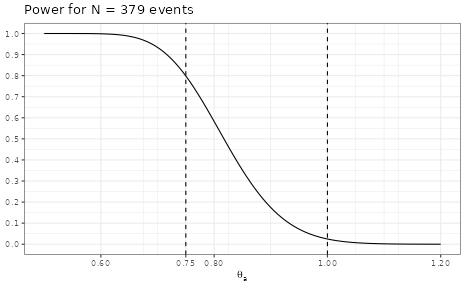
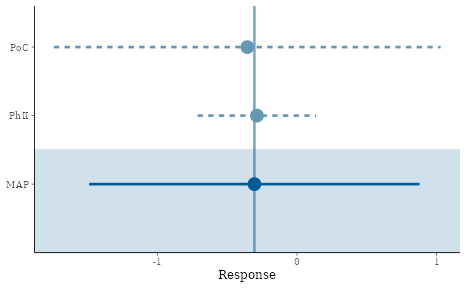
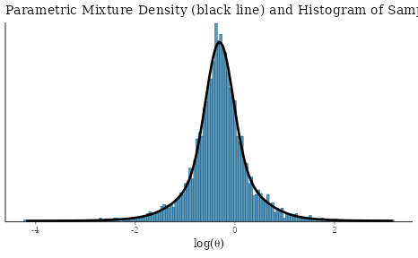
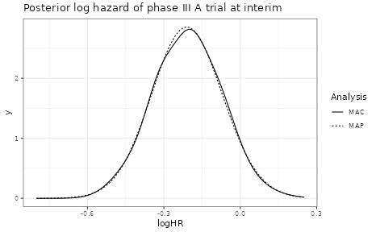

# Probability of Success with Co-Data

The probability of success is a very useful concept to assess the
chances of success of a trial while taking uncertainties into account.
In this document we briefly introduce the needed formal details,
describe an example data set and then demonstrate various ways of how
the probability of success concept can be applied to increasingly
complex data situations.

## Introduction

The co-data concept has been introduced in \[1\]. It differs from the
use of historical data in that the approach makes use of contemporary
data. A meta-analytic-predictive (MAP) analysis assumes that historical
data is known at the time-point of specyfing the analysis and is as such
a retrospective summary of available data. The MAP prior is then
combined with the current trial data. A co-data approach extends this
sequential procedure to a meta-analytic-combined (MAC) analysis. In the
MAC approach all available data is analyzed in a single step - that is,
historical and concurrent data is combined in a single inference step.
Both approaches MAP and MAC yield exactly the same results as is
demonstrated in the appendix at the bottom. An example for a co-data
scenario in drug development is the simultaneous execution of twin phase
III trails for registriation. In such a setting, a futility analysis at
an interim analysis may take historical and all contemporary data into
account in a co-data approach. This example has been discussed in \[1\]
using the probability of success (PoS) as metric to assess futility at
an interim analysis and is discussed here in detail.

The key property of the probability of success metric is the
consideration of uncertainty in parameters conditional on available
data. In contrast, the conditional power (CP) calculates the frequency a
given experemintal design will be successful for a known value of the
parameters. For example, in a 1-sample experiment with a one-sided
success criterion the trial is successful if the collected data $y_{N}$
of sample size $N$ exceeds some critical value $y_{c}$; recall that the
critical value $y_{c}$ is determined by the success criterion, prior and
sample size when evaluated. Assuming that the sampling model of the data
is $p\left( y|\theta \right)$, then

$$CP_{N}(\theta) = \int I\left( y_{N} > y_{c} \right)\, p\left( y_{N}|\theta \right)\, dy_{N}.$$

The integration over the data $y_{N}$ comprises all possible outcomes of
the trial. Note that before the start of the trial,
$CP_{N}\left( \theta_{0} \right)$ is the type I error rate under the
conventional null hypothesis ($\theta = \theta_{0}$) and
$CP_{N}\left( \theta_{a} \right)$ the power of the trial under the
alternative ($\theta = \theta_{a}$). At an interim analysis at sample
size $n_{I}$, the conditional power is then evaluated conditional on the
observed data so far (the $n_{I}$ measurements) while the remaining
sample size ($N - n_{I}$) is random and distributed according to
$p\left( y|\theta \right)$ with $\theta$ set to some known value,

$$CP_{N - n_{I}}\left( \theta|y_{n_{I}} \right) = \int I\left( y_{n_{I}} + y_{N - n_{I}} = y_{N} > y_{c}|y_{n_{I}} \right)\, p\left( y_{N - n_{I}}|\theta \right)\, dy_{N - n_{I}}.$$

The known value can be set equal to the observed point estimate at the
interim,
$CP_{N - n_{I}}\left( {\widehat{\theta}}_{I}|y_{n_{I}} \right)$, or to
the assumed true alternative,
$CP_{N - n_{I}}\left( \theta_{a}|y_{n_{I}} \right)$, used to plan the
trial.

The probability of success in contrast assigns $\theta$ a distribution
and marginalizes the conditional power over this distribution. In
absence of additional trial external information this distribution is
the posterior for $p\left( \theta|y_{n_{I}} \right)$ obtained from the
prior for $p(\theta)$ and the data collected up to the interim,

$$PoS_{I} = \int CP_{N - n_{I}}\left( \theta|y_{n_{I}} \right)\, p\left( \theta|y_{n_{I}} \right)\, d\theta.$$

However, our knowledge about $\theta$ can be refined if other
data-sources like completed (historical) or concurrent trials are
available,

$$PoS_{I,H,...} = \int CP_{N - n_{I}}\left( \theta|y_{n_{I}} \right)\, p\left( \theta|y_{I},y_{H},... \right)\, d\theta.$$

It is important to note that the conditional power is *always* evaluated
with respect to the trial data (and prior) only. Thus, additional
data-sources are not part of the analysis of the trial. In practice this
means that the probability of success is usually calculated for a trial
which uses non-informative priors, but at interim we may use additional
data-sources to refine our knowledge on $\theta$ which will not be part
of the trial analysis.

## Example Data Scenario

In the following the hypothetical example as in \[1\] is discussed. The
assumed endpoint is time-to-event, which is analyzed using the normal
approximation of the log-rank statistic for comparing two groups. Under
a 1:1 randomization the standard error of the log-hazard ratio scales
with the number of events as $2/\sqrt{N_{events}}$. This implies a
corresponding sampling standard deviation of $2$, which defines the unit
information prior used later on in the analysis. The historical data
considered is a proof of concept and a phase II trial. The twin phase
III studies are event driven. Each trial stops whenever a total of $379$
events is reached and an interim is planned whenever at least $150$
events have occured. The assumed true hazard ratio used for the design
of the trial is $0.8$.

Example data:

``` r
trials <- data.frame(
  study = c("PoC", "PhII", "PhIII_A", "PhIII_B"),
  deaths = c(8, 85, 162, 150),
  HR = c(0.7, 0.75, 0.83, 0.78),
  stringsAsFactors = FALSE
)
## under the normal approximation of the log-HR, the sampling sd is 2
## such that the standard errors are sqrt(4/events)
trials <- trials %>%
  mutate(logHR = log(HR), sem = sqrt(4 / deaths))
kable(trials, digits = 2)
```

| study   | deaths |   HR | logHR |  sem |
|:--------|-------:|-----:|------:|-----:|
| PoC     |      8 | 0.70 | -0.36 | 0.71 |
| PhII    |     85 | 0.75 | -0.29 | 0.22 |
| PhIII_A |    162 | 0.83 | -0.19 | 0.16 |
| PhIII_B |    150 | 0.78 | -0.25 | 0.16 |

The remaining outline of the vignette is to first evaluate the design
properties of the trials, then calculate the probability of success at
interim for the A trial only (using only trial A data). Next, the
probability of success is calculated using in addition the historical
data. Subsequently, the probability of success for trial A is calculated
also using the historical data *and* the concurrent phase III data of
trial B. Finally, the overall probability of success is calculated,
which is defined by the joint success of both trials. In the appendix
the equivalence of the MAP and MAC approach is demonstrated.

## Statistical Trial Design Considerations

Key design choices:

- time-to-event endpoint
- phase III trials stop at target \# of events 379
- null hypothesis of no difference in HR, $\theta_{0} = 1.0$
- one-sided $\alpha = 0.025$
- alternative hypothesis assumes true HR of $\theta_{a} = 0.75$
- interim when at least 150 events reached

Historical data:

- promising internal PoC
- promising phase II

Co-data:

- two phase III trials run in parallel $\Rightarrow$ each phase III
  trial is *concurrent* with the other

Define design choices

``` r
Nev <- 379

alt_HR <- 0.75
alt_logHR <- log(alt_HR)

alpha <- 0.025
```

### Power calculation

Here we use the unit information prior as non-informative prior and
define it using the mean & effective sample size (ESS) specification:

``` r
unit_inf <- mixnorm(c(1, 0, 1), sigma = 2, param = "mn")
unit_inf
```

    ## Univariate normal mixture
    ## Reference scale: 2
    ## Mixture Components:
    ##   comp1
    ## w 1    
    ## m 0    
    ## s 2

Define conditional power for the overall trial:

``` r
success_crit <- decision1S(1 - alpha, 0)
## let's print the defined criterion
success_crit
```

    ## 1 sample decision function
    ## Conditions for acceptance:
    ## P(theta <= 0) > 0.975

``` r
design <- oc1S(unit_inf, Nev, success_crit, sigma = 2)
```

Under the alternative these design choices result in 80% power

``` r
design(alt_logHR)
```

    ## [1] 0.7986379

The impact of the unit-information prior is minimal which can be seen by
comparing to the frequentist calculation:

``` r
power.t.test(n = Nev, delta = -1 * alt_logHR, sd = 2, type = "one.sample", sig.level = 0.025, alternative = "one.sided")
```

    ## 
    ##      One-sample t test power calculation 
    ## 
    ##               n = 379
    ##           delta = 0.2876821
    ##              sd = 2
    ##       sig.level = 0.025
    ##           power = 0.7976343
    ##     alternative = one.sided

With RBesT we can explore the conditional power for a range of
alternatives:

``` r
ggplot(data.frame(HR = c(0.5, 1.2)), aes(HR)) +
  stat_function(fun = compose(design, log)) +
  vline_at(c(alt_HR, 1.0), linetype = I(2)) +
  scale_y_continuous(breaks = seq(0, 1, by = 0.1)) +
  scale_x_continuous(breaks = c(alt_HR, seq(0, 1.2, by = 0.2))) +
  ylab(NULL) +
  xlab(expression(theta[a])) +
  ggtitle(paste("Power for N =", Nev, "events"))
```



### Critical value

The critical value determines at which observed logHR we *just* conclude
that the success criterion is fulfilled.

``` r
design_crit <- decision1S_boundary(unit_inf, Nev, success_crit, sigma = 2)

design_crit
```

    ## [1] -0.2017185

``` r
exp(design_crit)
```

    ## [1] 0.8173249

We can check this:

``` r
success_crit(postmix(unit_inf, m = design_crit, n = 379))
```

    ## Using default prior reference scale 2

    ## [1] 1

Ok, when observing the critical value, we get a success.

Now, what if we observe a 1% worse result?

``` r
success_crit(postmix(unit_inf, m = design_crit + log(1.01), n = 379))
```

    ## Using default prior reference scale 2

    ## [1] 0

No success then $\Rightarrow$ this is the critical boundary value.

## PoS at interim for phase III trial A only

### No use of historical information

Posterior of treatment effect at interim. The trial uses a
non-informative prior for the treatment effect:

``` r
interim_A <- postmix(unit_inf, m = trials$logHR[3], se = trials$sem[3])
interim_A
```

    ## Univariate normal mixture
    ## Reference scale: 2
    ## Mixture Components:
    ##   comp1     
    ## w  1.0000000
    ## m -0.1851865
    ## s  0.1566521

Now we are interested in the PoS at trial completion. The prior to use
for the analysis of the second half is given by the data collected so
far.

``` r
interim_pos_A <- pos1S(interim_A, Nev - trials$deaths[3], success_crit, sigma = 2)
```

The returned function can now calculate the PoS assuming any
distribution on the treatment effect. In case we do not use any
historical information, then this is just the interim posterior:

``` r
interim_pos_A(interim_A)
```

    ## [1] 0.4465623

The above command integrates the *conditional power* over the
uncertainty which we have about the treatment effect as defined above
for $PoS_{I}$.

The conditional power and the operating characteristics of a trial
coincide whenever we do not condition on any observed data. The key
difference of the conditional power as compared to the probability of
success is that it assumes a known value for the parameter of interest.
This can be seen as follows: First define the conditional power which is
conditional on the observed data,
$CP_{N - n_{I}}\left( \theta|y_{n_{I}} \right)$:

``` r
interim_oc_A <- oc1S(interim_A, Nev - trials$deaths[3], success_crit, sigma = 2)
```

The conditional power assuming the alternative is true (a HR of 0.75):

``` r
interim_oc_A(alt_logHR)
```

    ## [1] 0.708769

In case there is no uncertainty of the treatment effect (here
$se = 10^{-}4$), then this result agrees with the probability of success
calculation:

``` r
interim_pos_A(mixnorm(c(1, alt_logHR, 1E-4)))
```

    ## [1] 0.7087689

For trial B the calculation is:

``` r
interim_B <- postmix(unit_inf, m = trials$logHR[4], se = trials$sem[4])
interim_pos_B <- pos1S(interim_B, Nev - trials$deaths[4], success_crit, sigma = 2)
interim_pos_B(interim_B)
```

    ## [1] 0.6411569

### Use of historical information - MAP approach

However, we have historical information of which we can take advantage
at the interim for a better informed decision.

Our data before the phase III trials includes the PoC and the phase II
trial. We now derive from these a MAP prior; recall that the MAP prior
is the prediction of the log-hazard ratio of a future trial:

``` r
base <- trials[1:2, ]

set.seed(342345)
base_map_mc <- gMAP(cbind(logHR, sem) ~ 1 | study,
  family = gaussian,
  data = base,
  weights = deaths,
  tau.dist = "HalfNormal", tau.prior = 0.5,
  beta.prior = cbind(0, 2)
)

forest_plot(base_map_mc, est = "MAP")
```



``` r
base_map <- automixfit(base_map_mc)

plot(base_map)$mix + xlab(expression(log(theta)))
```



``` r
base_map
```

    ## EM for Normal Mixture Model
    ## Log-Likelihood = -3045.725
    ## 
    ## Univariate normal mixture
    ## Reference scale: 2
    ## Mixture Components:
    ##   comp1      comp2      comp3     
    ## w  0.5120402  0.3842310  0.1037289
    ## m -0.3102860 -0.2863639 -0.3285249
    ## s  0.2706592  0.6293296  1.1087960

At the interim we have even more knowledge available on the treatment
effect through the interim data itself which we can include into the MAP
prior:

``` r
interim_A_combined <- postmix(base_map, m = trials$logHR[3], se = trials$sem[3])
```

The PoS for this posterior at interim (representing historical *and*
interim data collected) is:

``` r
interim_pos_A(interim_A_combined)
```

    ## [1] 0.4937129

Note that we have not redefined `interim_pos_A`, such that this
calculates the PoS for the phase III A trial taking into account that
the final analysis will use a non-informative prior.

For trial B the calculation is:

``` r
interim_B_combined <- postmix(base_map, m = trials$logHR[4], se = trials$sem[4])
interim_pos_B(interim_B_combined)
```

    ## [1] 0.6762344

### Use of historical information - MAC approach

However, there is even more information which can be used here, since
the phase III result of trial B is also available:

``` r
interim_map_mc <- update(base_map_mc, data = trials)
```

Now the trial B specific posterior at interim is

``` r
kable(fitted(interim_map_mc), digits = 3)
```

|         |   mean |    sd |   2.5% |    50% | 97.5% |
|:--------|-------:|------:|-------:|-------:|------:|
| PoC     | -0.253 | 0.243 | -0.772 | -0.245 | 0.233 |
| PhII    | -0.254 | 0.150 | -0.561 | -0.251 | 0.031 |
| PhIII_A | -0.214 | 0.126 | -0.456 | -0.216 | 0.040 |
| PhIII_B | -0.239 | 0.128 | -0.492 | -0.239 | 0.009 |

which we can extract as:

1.  obtain posterior (which we restrict to the first 4 columns)

``` r
interim_map_post <- as.matrix(interim_map_mc)[, 1:4]

dim(interim_map_post) # posterior is given as matrix: iteration x parameter
```

    ## [1] 4000    4

``` r
head(interim_map_post, n = 3)
```

    ##           parameters
    ## iterations   theta[1]   theta[2]   theta[3]    theta[4]
    ##       [1,] -0.4277097 -0.1835350 -0.1678440 -0.07992145
    ##       [2,] -0.3229801 -0.3425734 -0.2638770 -0.35817687
    ##       [3,] -0.3251523 -0.2242466 -0.1748201 -0.25177923

2.  turn MCMC posterior sample into parametric mixture

``` r
interim_A_allcombined <- automixfit(interim_map_post[, "theta[3]"])
```

3.  and finally evaluate the PoS

``` r
interim_pos_A(interim_A_allcombined)
```

    ## [1] 0.5010266

which aligns with the published result under the assumption of full
exchangeability.

For trial B computations are:

``` r
interim_B_allcombined <- automixfit(interim_map_post[, "theta[4]"])
interim_pos_B(interim_B_allcombined)
```

    ## [1] 0.6431324

## Differential discounting

Differential discounting allows to weight different data-sources
differently. For example, we may assume greater heterogeneity for the
historical data in comparison to the twin phase III trials.

Assign data to historical (2) and concurrent data strata (1):

``` r
trials <- trials %>% mutate(stratum = c(2, 2, 1, 1))

kable(trials, digits = 2)
```

| study   | deaths |   HR | logHR |  sem | stratum |
|:--------|-------:|-----:|------:|-----:|--------:|
| PoC     |      8 | 0.70 | -0.36 | 0.71 |       2 |
| PhII    |     85 | 0.75 | -0.29 | 0.22 |       2 |
| PhIII_A |    162 | 0.83 | -0.19 | 0.16 |       1 |
| PhIII_B |    150 | 0.78 | -0.25 | 0.16 |       1 |

``` r
set.seed(435345)
interim_diff_map_mc <- gMAP(cbind(logHR, sem) ~ 1 | study,
  tau.strata = stratum,
  family = gaussian,
  data = trials,
  weights = deaths,
  tau.dist = "HalfNormal", tau.prior = c(0.5, 1),
  beta.prior = cbind(0, 2)
)

interim_diff_map_post <- as.matrix(interim_diff_map_mc)[, 1:4]

interim_A_diff_allcombined <- automixfit(interim_diff_map_post[, "theta[3]"])
interim_B_diff_allcombined <- automixfit(interim_diff_map_post[, "theta[4]"])

interim_pos_A(interim_A_diff_allcombined)
```

    ## [1] 0.498148

``` r
interim_pos_B(interim_B_diff_allcombined)
```

    ## [1] 0.6459292

## PoS for both phase III trials being successful

So far we have only calculated the individual PoS per trial, but more
interesting is the *overall* PoS for both trials being successful.

Recall, the PoS is the conditional power integrated over an assumed true
effect distribution. Hence, we had for trial A:

``` r
interim_pos_A(interim_A)
```

    ## [1] 0.4465623

As explained, the conditional power is the operating characerstic of a
design when conditioning on the already observed data:

``` r
interim_oc_A <- oc1S(interim_A, Nev - trials$deaths[3], success_crit, sigma = 2)
```

The PoS is then the integral of the conditional power over the parameter
space $\theta$ representing our knowledge. This integral can be
evaluated in a Monte-Carlo (MC) approach as

$$PoS_{I} = \int CP_{N - n_{I}}\left( \theta|y_{n_{I}} \right)\, p\left( \theta|y_{n_{I}} \right)\, d\theta \approx \frac{1}{S}\sum\limits_{i = 1}^{S}CP\left( \theta_{i} \right),$$

whenever we have a sample of $p\left( \theta|y_{n_{I}} \right)$ of size
$S$… which we have:

``` r
interim_A_samp <- rmix(interim_A, 1E4)
mean(interim_oc_A(interim_A_samp))
```

    ## [1] 0.4479449

This is an MC approach to calculating the PoS.

When now considering the probability for both trials being successful we
have to perform an MC integration over the joint density
$p\left( \theta_{A},\theta_{B}|y_{n_{I_{A}}},y_{n_{I_{B}}} \right)$

$$\begin{aligned}
{PoS} & {= \iint CP_{N - n_{I_{A}}}\left( \theta_{A}|y_{n_{I_{A}}} \right)\, CP_{N - n_{I_{B}}}\left( \theta_{B}|y_{n_{I_{B}}} \right)\, p\left( \theta_{A},\theta_{B}|y_{n_{I_{A}}},y_{n_{I_{B}}} \right)\, d\theta_{A}d\theta_{B}} \\
 & {\approx \frac{1}{S}\sum\limits_{i = 1}^{S}CP_{N - n_{I_{A}}}\left( \theta_{A,i}|y_{n_{I_{A}}} \right)\, CP_{N - n_{I_{B}}}\left( \theta_{B,i}|y_{n_{I_{B}}} \right).}
\end{aligned}$$

Thus we need to also get the conditional power for trial B at interim…

``` r
interim_oc_B <- oc1S(interim_B, Nev - trials$deaths[4], success_crit, sigma = 2)
```

…and integrate over the posterior samples (differential discounting
case)

``` r
mean(interim_oc_A(interim_diff_map_post[, "theta[3]"]) * interim_oc_B(interim_diff_map_post[, "theta[4]"]))
```

    ## [1] 0.3472287

which is slightly larger than assuming independence:

``` r
interim_pos_A(interim_A) * interim_pos_B(interim_B)
```

    ## [1] 0.2863165

This is due to dependence of the posteriors

``` r
cor(interim_diff_map_post[, c("theta[3]", "theta[4]")])
```

    ##           theta[3]  theta[4]
    ## theta[3] 1.0000000 0.2844492
    ## theta[4] 0.2844492 1.0000000

For the full exchangeability case we have

``` r
mean(interim_oc_A(interim_map_post[, "theta[3]"]) * interim_oc_B(interim_map_post[, "theta[4]"]))
```

    ## [1] 0.351044

## Summary

We have now calculated with increasing complexity the probability of
success for various data constellations. As new trials are only
conducted whenever previous trial results were positive, it is important
to take note of the potential selection bias. Moreover, adding more
historical data sources in this situation will likely increase the
probability of success as illustrated by this summary of our preceding
calculations.

Phase III trial A:

``` r
## only interim data of trial A
interim_pos_A(interim_A)
```

    ## [1] 0.4465623

``` r
## in addition with prior historical data PoC & phase II data
interim_pos_A(interim_A_combined)
```

    ## [1] 0.4937129

``` r
## finally with the interim data of the phase III B
interim_pos_A(interim_A_allcombined)
```

    ## [1] 0.5010266

Phase III trial B:

``` r
## only interim data of trial B
interim_pos_B(interim_B)
```

    ## [1] 0.6411569

``` r
## in addition with prior historical data PoC & phase II data
interim_pos_B(interim_B_combined)
```

    ## [1] 0.6762344

``` r
## finally with the interim data of the phase III A
interim_pos_B(interim_B_allcombined)
```

    ## [1] 0.6431324

## Appendix: MAP and MAC equivalence

In the preceeding sections we have used MAP and MAC equivalence already.
The proof for the equivalence is presented reference in \[2\]. The
formal deriavtion is shown at the end of this section

While MAP and MAC provide the exact same results, the difference is a
sequential vs a joint analysis as (see also \[2\]):

1.  MAP: Summarize historical information as MAP and then update the MAP
    with the trial result (MCMC, then `postmix`).
2.  MAC: Directly summarize historical information and trial result in a
    single step (only MCMC on all data).

The two results above using MAP and MAC did not line up. The reason here
is that the MAP approach used the historical data and the phase III
trial A interim data only. In contrast, the MAC approach used the
historical data and interim phase III data of both trials. To show the
equivalence we need to align this mismatch of used data.

Run `gMAP` with base data and produce a large MCMC sample (10 chains) to
get a very high precision.

``` r
base_map_mc_2 <- gMAP(cbind(logHR, sem) ~ 1 | study,
  family = gaussian,
  data = base,
  weights = deaths,
  tau.dist = "HalfNormal", tau.prior = 0.5,
  beta.prior = cbind(0, 2),
  chains = ifelse(is_CRAN, 2, 20)
)
```

Force an accurate fit with 5 components:

``` r
base_map_2 <- mixfit(base_map_mc_2, Nc = 5)
base_map_2
```

    ## EM for Normal Mixture Model
    ## Log-Likelihood = -15194.35
    ## 
    ## Univariate normal mixture
    ## Reference scale: 2
    ## Mixture Components:
    ##   comp1        comp2        comp3        comp4        comp5       
    ## w  0.422805992  0.193045120  0.180150391  0.136953059  0.067045438
    ## m -0.294295380  0.030002665 -0.640006757 -0.005626679 -0.895903411
    ## s  0.239643807  0.363653776  0.363772982  0.921427263  0.873766906

Now, combine the MAP prior (representing historical knowledge) with the
interim data of trial A:

``` r
interim_A_combined_2 <- postmix(base_map_2, m = trials$logHR[3], se = trials$sem[3])
```

1.  Run the respective MAC analysis (thus we need historical data +
    phase III A trial, but excluding the phase III B data):

``` r
interim_map_mc_2 <- update(base_map_mc_2, data = trials[-4, ])
```

    ## Warning: There were 1 divergent transitions after warmup. See
    ## https://mc-stan.org/misc/warnings.html#divergent-transitions-after-warmup
    ## to find out why this is a problem and how to eliminate them.

    ## Warning: Examine the pairs() plot to diagnose sampling problems

    ## Warning in gMAP(formula = cbind(logHR, sem) ~ 1 | study, family = gaussian, : In total 1 divergent transitions occured during the sampling phase.
    ## Please consider increasing adapt_delta closer to 1 with the following command prior to gMAP:
    ## options(RBesT.MC.control=list(adapt_delta=0.999))

``` r
interim_map_post_2 <- as.matrix(interim_map_mc_2)[, 1:3]
```

2.  turn MCMC posterior sample into parametric mixture

``` r
interim_A_allcombined_2 <- mixfit(interim_map_post_2[, "theta[3]"], Nc = 5)

interim_A_allcombined_2
```

    ## EM for Normal Mixture Model
    ## Log-Likelihood = 10809.89
    ## 
    ## Univariate normal mixture
    ## Mixture Components:
    ##   comp1       comp2       comp3       comp4       comp5      
    ## w  0.22013923  0.21952317  0.21758668  0.21256832  0.13018260
    ## m -0.20357325 -0.09400613 -0.30634332 -0.10229635 -0.40626966
    ## s  0.05801007  0.13048140  0.06090041  0.07378703  0.08626407

Now let’s overlay the two posterior’s

``` r
ggplot(data.frame(logHR = c(-0.8, 0.25)), aes(logHR)) +
  stat_function(fun = dmix, args = list(mix = interim_A_combined_2), aes(linetype = "MAP")) +
  stat_function(fun = dmix, args = list(mix = interim_A_allcombined_2), aes(linetype = "MAC")) +
  scale_linetype_discrete("Analysis") +
  ggtitle("Posterior log hazard of phase III A trial at interim")
```



The PoS is essentially the same

``` r
interim_pos_A(interim_A_combined_2)
```

    ## [1] 0.4900712

``` r
interim_pos_A(interim_A_allcombined_2)
```

    ## [1] 0.487749

### Formal MAP and MAC equivalence

The stated equivalence requires that the posterior of a trial specific
parameter

$$p\left( \theta_{\star}|y_{\star},y_{H} \right),$$

which is conditional on the trial specific data $y_{\star}$**and** the
historical data $y_{H}$ (MAC approach, joint use of $y_{H},y_{\star}$),
is equivalent to obtaining the MAP prior
$p\left( \theta_{\star}|y_{H} \right)$ based on the historical data and
then analyzing the new trial with this prior.

$$\begin{aligned}
{p\left( \theta_{\star}|y_{\star},y_{H} \right)} & {\propto p\left( \theta_{\star},\theta_{H}|y_{\star},y_{H} \right)} \\
 & {\propto p\left( y_{\star},y_{H}|\theta_{\star},\theta_{H} \right)\, p\left( \theta_{\star},\theta_{H} \right)} \\
 & {= p\left( y_{\star}|\theta_{\star} \right)\, p\left( y_{H}|\theta_{H} \right)\, p\left( \theta_{\star},\theta_{H} \right)} \\
 & {\propto p\left( y_{\star}|\theta_{\star} \right)\, p\left( \theta_{\star},\theta_{H}|y_{H} \right)} \\
 & {\propto p\left( y_{\star}|\theta_{\star} \right)\, p\left( \theta_{\star}|y_{H} \right)}
\end{aligned}$$

The equivalence holds under the use of the meta-analytic model.

## References

\[1\] Neuenschwander, B., Roychoudhury, S., & Schmidli, H. (2016). On
the Use of Co-Data in Clinical Trials. Statistics in Biopharmaceutical
Research, 8(3), 345-354.

\[2\] 1. Schmidli H, Gsteiger S, Roychoudhury S, O’Hagan A,
Spiegelhalter D, Neuenschwander B. Robust meta-analytic-predictive
priors in clinical trials with historical control information.
Biometrics. 2014;70(4):1023-1032.

## R Session Info

``` r
sessionInfo()
```

    ## R version 4.5.3 (2026-03-11)
    ## Platform: x86_64-pc-linux-gnu
    ## Running under: Ubuntu 24.04.3 LTS
    ## 
    ## Matrix products: default
    ## BLAS:   /usr/lib/x86_64-linux-gnu/openblas-pthread/libblas.so.3 
    ## LAPACK: /usr/lib/x86_64-linux-gnu/openblas-pthread/libopenblasp-r0.3.26.so;  LAPACK version 3.12.0
    ## 
    ## locale:
    ##  [1] LC_CTYPE=C.UTF-8       LC_NUMERIC=C           LC_TIME=C.UTF-8       
    ##  [4] LC_COLLATE=C.UTF-8     LC_MONETARY=C.UTF-8    LC_MESSAGES=C.UTF-8   
    ##  [7] LC_PAPER=C.UTF-8       LC_NAME=C              LC_ADDRESS=C          
    ## [10] LC_TELEPHONE=C         LC_MEASUREMENT=C.UTF-8 LC_IDENTIFICATION=C   
    ## 
    ## time zone: UTC
    ## tzcode source: system (glibc)
    ## 
    ## attached base packages:
    ## [1] stats     graphics  grDevices utils     datasets  methods   base     
    ## 
    ## other attached packages:
    ## [1] purrr_1.2.1      dplyr_1.2.0      bayesplot_1.15.0 ggplot2_4.0.2   
    ## [5] knitr_1.51       RBesT_1.9-0     
    ## 
    ## loaded via a namespace (and not attached):
    ##  [1] gtable_0.3.6          tensorA_0.36.2.1      xfun_0.56            
    ##  [4] bslib_0.10.0          QuickJSR_1.9.0        htmlwidgets_1.6.4    
    ##  [7] inline_0.3.21         vctrs_0.7.1           tools_4.5.3          
    ## [10] generics_0.1.4        stats4_4.5.3          parallel_4.5.3       
    ## [13] tibble_3.3.1          pkgconfig_2.0.3       checkmate_2.3.4      
    ## [16] RColorBrewer_1.1-3    S7_0.2.1              desc_1.4.3           
    ## [19] distributional_0.6.0  RcppParallel_5.1.11-2 assertthat_0.2.1     
    ## [22] lifecycle_1.0.5       compiler_4.5.3        farver_2.1.2         
    ## [25] stringr_1.6.0         textshaping_1.0.5     codetools_0.2-20     
    ## [28] htmltools_0.5.9       sass_0.4.10           yaml_2.3.12          
    ## [31] Formula_1.2-5         pillar_1.11.1         pkgdown_2.2.0        
    ## [34] jquerylib_0.1.4       cachem_1.1.0          StanHeaders_2.32.10  
    ## [37] abind_1.4-8           posterior_1.6.1       rstan_2.32.7         
    ## [40] tidyselect_1.2.1      digest_0.6.39         mvtnorm_1.3-5        
    ## [43] stringi_1.8.7         reshape2_1.4.5        labeling_0.4.3       
    ## [46] fastmap_1.2.0         grid_4.5.3            cli_3.6.5            
    ## [49] magrittr_2.0.4        loo_2.9.0             pkgbuild_1.4.8       
    ## [52] withr_3.0.2           scales_1.4.0          backports_1.5.0      
    ## [55] rmarkdown_2.30        matrixStats_1.5.0     otel_0.2.0           
    ## [58] gridExtra_2.3         ragg_1.5.1            evaluate_1.0.5       
    ## [61] rstantools_2.6.0      rlang_1.1.7           Rcpp_1.1.1           
    ## [64] glue_1.8.0            jsonlite_2.0.0        plyr_1.8.9           
    ## [67] R6_2.6.1              systemfonts_1.3.2     fs_1.6.7
