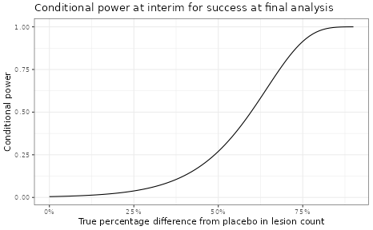

# Probability of Success at an Interim Analysis

At different stages of drug development, there are questions about how
likely a study will be successful given previously collected data within
the trial itself or data from other earlier trials. For example given
Ph2a (PoC, proof of concept) and Ph2b (DRF, dose range finding) studies,
how likely a new Ph3 study would be successful is of great interest.
Another example, at an interim analysis (IA) of a PoC study, one would
also be interested to understand the probability of success at the end
of the study given the partial data observed.
**[`pos1S()`](https://opensource.nibr.com/RBesT/reference/pos1S.md)**
and
**[`pos2S()`](https://opensource.nibr.com/RBesT/reference/pos2S.md)**
are constructed to calculate predictive probabilities for this purpose
to inform quantitative decision making. This vignette shows an example
from an IA in a PoC study, where
**[`pos2S()`](https://opensource.nibr.com/RBesT/reference/pos2S.md)**
was used to explore the probability of success for the final analysis
given the interim data.

The primary endpoint for this study is log transformed facial lesion
count, assumed to be normally distributed. Decrease in the lesion count
upon treatment is considered improvement in the patients. Below is the
summary statistics of this primary endpoint by group at the interim.

``` r
ia <- data.frame(
  n = c(12, 14),
  median_count = c(20.5, 21),
  mean_count = c(23.3, 27),
  mean_log = c(2.96, 3.03),
  sd_log = c(0.67, 0.774),
  row.names = c("active", "placebo")
) %>%
  transform(se_log = round(sd_log / sqrt(n), 3))
sd_log_pooled <- with(ia, sqrt(sum(sd_log^2 * (n - 1)) / (sum(n) - 2)))
kable(ia)
```

|         |   n | median_count | mean_count | mean_log | sd_log | se_log |
|:--------|----:|-------------:|-----------:|---------:|-------:|-------:|
| active  |  12 |         20.5 |       23.3 |     2.96 |  0.670 |  0.193 |
| placebo |  14 |         21.0 |       27.0 |     3.03 |  0.774 |  0.207 |

The predefined dual PoC criteria is as follows,

``` r
n <- 21 # planned total n per arm
rules <- decision2S(c(0.9, 0.5), c(0, -0.357), lower.tail = TRUE)
print(rules)
```

    ## 2 sample decision function
    ## Conditions for acceptance:
    ## P(theta1 - theta2 <= 0) > 0.9
    ## P(theta1 - theta2 <= -0.357) > 0.5
    ## Link: identity

The interim data were evaluated against the PoC criteria with weakly
informative priors for both active and placebo groups. The criteria were
not met, although it seemed to show some benefit of the active treatment
over placebo numerically. The variability of this endpoint is higher
than what was assumed for study sample size calculation.

``` r
priorP <- priorT <- mixnorm(c(1, log(20), 1), sigma = 0.47, param = "mn")
## posterior at IA data
postT_interim <- postmix(priorT, m = ia["active", "mean_log"], se = ia["active", "se_log"])
postP_interim <- postmix(priorP, m = ia["placebo", "mean_log"], se = ia["placebo", "se_log"])
pmixdiff(postT_interim, postP_interim, 0)
```

    ## [1] 0.5900663

``` r
pmixdiff(postT_interim, postP_interim, -0.357)
```

    ## [1] 0.12637

The probability of success at the final analysis, i.e. the probability
of meeting PoC criteria at trial completion given observed interim data,
was computed using function
**[`pos2S()`](https://opensource.nibr.com/RBesT/reference/pos2S.md)**.
One could assume that the new data after the interim would be from the
same distribution as the interim data. If the $\sigma_{1}$ and
$\sigma_{2}$ in
**[`pos2S()`](https://opensource.nibr.com/RBesT/reference/pos2S.md)**
were not specified, i.e. the previously assumed $\sigma$ would be used.

``` r
pos_final <- pos2S(
  postT_interim,
  postP_interim,
  n - ia["active", "n"],
  n - ia["placebo", "n"],
  rules,
  sigma1 = sd_log_pooled,
  sigma2 = sd_log_pooled
)
```

The function constructed by
**[`pos2S()`](https://opensource.nibr.com/RBesT/reference/pos2S.md)**
can produce the predictive probability given any defined distribution
for the two groups. For example, if the interim posterior distributions
are used, the calculated probability is small, suggesting a low chance
of success at the final analysis given observed IA data.

``` r
pos_final(postT_interim, postP_interim)
```

    ## [1] 0.02413245

One can also use
**[`oc2S()`](https://opensource.nibr.com/RBesT/reference/oc2S.md)** to
compute conditional power for any given treatment effect.

``` r
ia_oc <- oc2S(
  postT_interim,
  postP_interim,
  n - ia["active", "n"],
  n - ia["placebo", "n"],
  rules,
  sigma1 = sd_log_pooled,
  sigma2 = sd_log_pooled
)

delta <- seq(0, 0.9, 0.01) # pct diff from pbo
pbomean <- ia["placebo", "mean_log"]
y1 <- log(exp(pbomean) * (1 - delta)) # active
y2 <- log(exp(pbomean) * (1 - 0 * delta)) # placebo

out <-
  data.frame(
    diff_pct = delta,
    diff = round(y1 - y2, 2),
    y_act = y1,
    y_pbo = y2,
    cp = ia_oc(y1, y2)
  )

ggplot(data = out, aes(x = diff_pct, y = cp)) +
  geom_line() +
  scale_x_continuous(labels = scales::percent) +
  labs(
    y = "Conditional power",
    x = "True percentage difference from placebo in lesion count",
    title = "Conditional power at interim for success at final analysis"
  )
```



### R Session Info

    ## R version 4.5.3 (2026-03-11)
    ## Platform: x86_64-pc-linux-gnu
    ## Running under: Ubuntu 24.04.3 LTS
    ## 
    ## Matrix products: default
    ## BLAS:   /usr/lib/x86_64-linux-gnu/openblas-pthread/libblas.so.3 
    ## LAPACK: /usr/lib/x86_64-linux-gnu/openblas-pthread/libopenblasp-r0.3.26.so;  LAPACK version 3.12.0
    ## 
    ## locale:
    ##  [1] LC_CTYPE=C.UTF-8       LC_NUMERIC=C           LC_TIME=C.UTF-8       
    ##  [4] LC_COLLATE=C.UTF-8     LC_MONETARY=C.UTF-8    LC_MESSAGES=C.UTF-8   
    ##  [7] LC_PAPER=C.UTF-8       LC_NAME=C              LC_ADDRESS=C          
    ## [10] LC_TELEPHONE=C         LC_MEASUREMENT=C.UTF-8 LC_IDENTIFICATION=C   
    ## 
    ## time zone: UTC
    ## tzcode source: system (glibc)
    ## 
    ## attached base packages:
    ## [1] stats     graphics  grDevices utils     datasets  methods   base     
    ## 
    ## other attached packages:
    ## [1] dplyr_1.2.0   scales_1.4.0  ggplot2_4.0.2 knitr_1.51    RBesT_1.9-0  
    ## 
    ## loaded via a namespace (and not attached):
    ##  [1] tensorA_0.36.2.1      sass_0.4.10           generics_0.1.4       
    ##  [4] digest_0.6.39         magrittr_2.0.4        evaluate_1.0.5       
    ##  [7] grid_4.5.3            RColorBrewer_1.1-3    mvtnorm_1.3-5        
    ## [10] fastmap_1.2.0         jsonlite_2.0.0        pkgbuild_1.4.8       
    ## [13] backports_1.5.0       Formula_1.2-5         gridExtra_2.3        
    ## [16] QuickJSR_1.9.0        codetools_0.2-20      textshaping_1.0.5    
    ## [19] jquerylib_0.1.4       abind_1.4-8           cli_3.6.5            
    ## [22] rlang_1.1.7           withr_3.0.2           cachem_1.1.0         
    ## [25] yaml_2.3.12           otel_0.2.0            StanHeaders_2.32.10  
    ## [28] parallel_4.5.3        inline_0.3.21         rstan_2.32.7         
    ## [31] tools_4.5.3           rstantools_2.6.0      checkmate_2.3.4      
    ## [34] assertthat_0.2.1      vctrs_0.7.1           posterior_1.6.1      
    ## [37] R6_2.6.1              stats4_4.5.3          matrixStats_1.5.0    
    ## [40] lifecycle_1.0.5       fs_1.6.7              htmlwidgets_1.6.4    
    ## [43] ragg_1.5.1            pkgconfig_2.0.3       desc_1.4.3           
    ## [46] pkgdown_2.2.0         RcppParallel_5.1.11-2 bslib_0.10.0         
    ## [49] pillar_1.11.1         gtable_0.3.6          loo_2.9.0            
    ## [52] glue_1.8.0            Rcpp_1.1.1            systemfonts_1.3.2    
    ## [55] xfun_0.56             tibble_3.3.1          tidyselect_1.2.1     
    ## [58] farver_2.1.2          htmltools_0.5.9       labeling_0.4.3       
    ## [61] rmarkdown_2.30        compiler_4.5.3        S7_0.2.1             
    ## [64] distributional_0.6.0
