# Customizing RBesT plots

## Introduction

This vignette demonstrates how to work with the forest plot provided by
the `RBesT` package. We show how to modify the default plot and, for
advanced users, how to extract data from a ggplot object to create a new
plot from scratch. Finally we recreate plots from a case study presented
in the training materials.

For more general information on plotting in R, we recommend the
following resources:

- [bayesplot](https://CRAN.R-project.org/package=bayesplot) - library on
  which the `RBesT` plotting functionality is built
- [ggplot2](https://ggplot2.tidyverse.org/reference/) - powerful library
  for graphics in R
- [R Cookbook - Graphs](http://www.cookbook-r.com/Graphs/) - general
  reference for R and graphics in R

``` r
# Load required libraries
library(RBesT)
library(ggplot2)
library(dplyr)
```

    ## 
    ## Attaching package: 'dplyr'

    ## The following objects are masked from 'package:stats':
    ## 
    ##     filter, lag

    ## The following objects are masked from 'package:base':
    ## 
    ##     intersect, setdiff, setequal, union

``` r
library(tidyr)
library(bayesplot)
```

    ## This is bayesplot version 1.15.0

    ## - Online documentation and vignettes at mc-stan.org/bayesplot

    ## - bayesplot theme set to bayesplot::theme_default()

    ##    * Does _not_ affect other ggplot2 plots

    ##    * See ?bayesplot_theme_set for details on theme setting

``` r
# Default settings for bayesplot
color_scheme_set("blue")
theme_set(theme_default(base_size = 12))

# Load example gMAP object
set.seed(546346)
map_crohn <- gMAP(cbind(y, y.se) ~ 1 | study,
  family = gaussian,
  data = transform(crohn, y.se = 88 / sqrt(n)),
  weights = n,
  tau.dist = "HalfNormal", tau.prior = 44,
  beta.prior = cbind(0, 88)
)

print(map_crohn)
```

    ## Generalized Meta Analytic Predictive Prior Analysis
    ## 
    ## Call:  gMAP(formula = cbind(y, y.se) ~ 1 | study, family = gaussian, 
    ##     data = transform(crohn, y.se = 88/sqrt(n)), weights = n, 
    ##     tau.dist = "HalfNormal", tau.prior = 44, beta.prior = cbind(0, 
    ##         88))
    ## 
    ## Exchangeability tau strata: 1 
    ## Prediction tau stratum    : 1 
    ## Maximal Rhat              : 1 
    ## Estimated reference scale : 88 
    ## 
    ## Between-trial heterogeneity of tau prediction stratum
    ##  mean    sd  2.5%   50% 97.5% 
    ## 14.00  9.44  1.27 12.10 38.70 
    ## 
    ## MAP Prior MCMC sample
    ##  mean    sd  2.5%   50% 97.5% 
    ## -50.3  19.1 -90.8 -48.7 -14.3

## Forest plot

The default forest plot is a “standard” forest plot with the
Meta-Analytic-Predictive (MAP) prior additionally summarized in the
bottom row:

``` r
forest_plot(map_crohn)
```

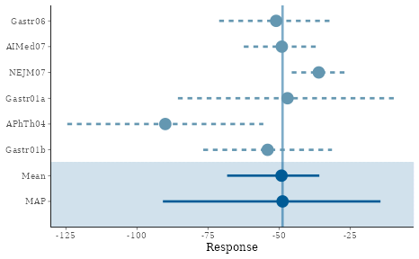

We can also include the model-based estimates for each study, and add a
legend to explain the different linetypes.

``` r
forest_plot(map_crohn, model = "both") + legend_move("right")
```

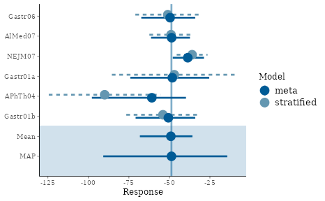

We can modify the color scheme as follows (refer to
[`help(color_scheme_set)`](https://mc-stan.org/bayesplot/reference/bayesplot-colors.html)
for a full list of themes):

``` r
# preview a color scheme
color_scheme_view("mix-blue-red")
```

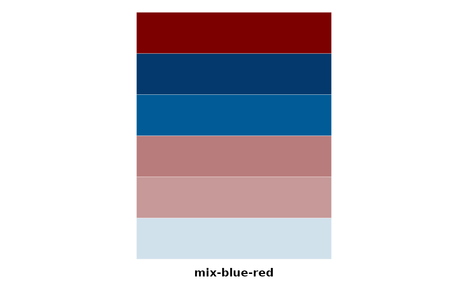

``` r
# and now let's use it
color_scheme_set("mix-blue-red")
forest_plot(map_crohn)
```

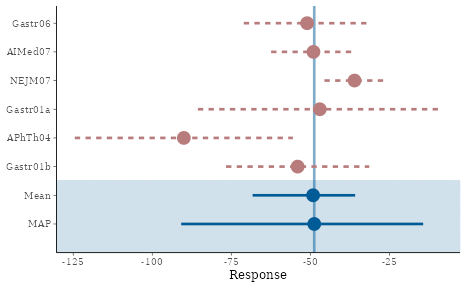

``` r
color_scheme_set("gray")
forest_plot(map_crohn)
```

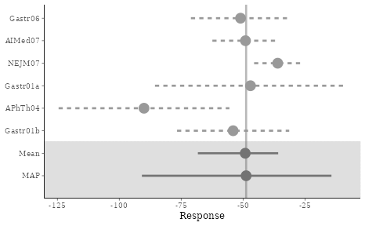

The point size can be modified and the vertical line removed:

``` r
color_scheme_set("blue")
forest_plot(map_crohn, size = 0.5, alpha = 0)
```

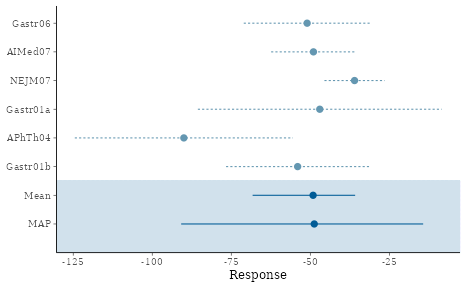

### Presentation-ready plots

If a plot is to be used for a presentation or in a document such as the
study protocol, it is recommended to use sufficiently large font sizes
(e.g. about as large as the fonts on the same slide or in the same
document) and that elements of the plot are clearly visible. Here we
show a few simple statements that can be used for this purpose.

``` r
# adjust the base font size
theme_set(theme_default(base_size = 16))
forest_plot(map_crohn, model = "both", est = "MAP", size = 1) + legend_move("right") +
  labs(
    title = "Forest plot", subtitle = "Results of Meta-Analytic-Predictive (MAP) analysis",
    caption = "Plot shows point estimates (posterior medians) with 95% intervals"
  )
```

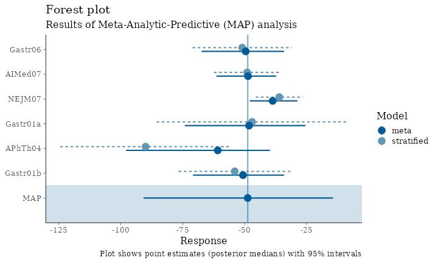

We also recommend saving plots explicitly with the `ggsave` function,
which allows control (and hence consistency) of image size. Note that
the font size will be enforced in the requested size; a small image with
large font size may result in too little space for the plot itself. The
image is sized according to the golden cut
($\phi = \frac{1 + \sqrt{5}}{2} \approx 1.62$) which is perceived as a
pleasing axis ratio. Png is the recommended image file type for
presentations and study documents.

``` r
ggsave("plot1.png", last_plot(), width = 1.62 * 2.78, height = 2.78, unit = "in") # too small for the chosen font size
ggsave("plot2.png", last_plot(), width = 1.62 * 5.56, height = 5.56, unit = "in") # fits a single ppt slide quite well
```

## Advanced topics

### Extract data from a `ggplot` object

In some situations, desired modifications to a plot provided by `RBesT`
may not be possible given the returned `ggplot` object. If a truly
tailored plot is desired, the user must extract the data from this
object and create a graph from scratch using `ggplot` functions. Recall
the original forest plot:

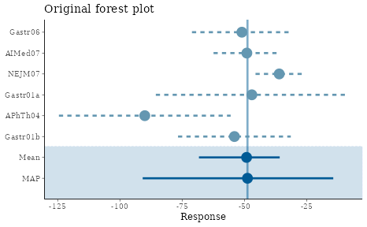

Suppose we wish to use different symbols for the meta/stratified point
estimates and a different linestyle for the vertical line. A tailored
plot can be created as follows.

``` r
# Extract the data from the returned object
fp_data <- forest_plot(map_crohn)$data
print(fp_data, digits = 2)
```

    ##                 mean  sem median  low    up    study      model
    ## Gastr06          -51 10.2    -51  -71 -30.9  Gastr06 stratified
    ## AIMed07          -49  6.8    -49  -62 -35.6  AIMed07 stratified
    ## NEJM07           -36  4.9    -36  -46 -26.5   NEJM07 stratified
    ## Gastr01a         -47 19.7    -47  -86  -8.4 Gastr01a stratified
    ## APhTh04          -90 17.6    -90 -124 -55.5  APhTh04 stratified
    ## Gastr01b         -54 11.6    -54  -77 -31.4 Gastr01b stratified
    ## theta_resp_pred  -50 19.1    -49  -91 -14.3      MAP       meta
    ## theta_resp       -50  8.3    -49  -68 -35.8     Mean       meta

``` r
# Use a two-component map mixture to compute the vertical line location
map_mix <- mixfit(map_crohn, Nc = 2)
# Finally compose a ggplot call for the desired graph
ggplot(fp_data, aes(x = study, y = median, ymin = low, ymax = up, linetype = model, shape = model)) +
  geom_pointrange(size = 0.7, position = position_dodge(width = 0.5)) +
  geom_hline(yintercept = qmix(map_mix, 0.5), linetype = 3, alpha = 0.5) +
  coord_flip() +
  theme_bw(base_size = 12) +
  theme(legend.position = "None") +
  labs(x = "", y = "Response", title = "Modified forest plot")
```

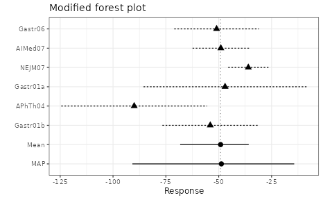

### Design plots a clinical trial

Here we show how to create outcome and operating characteristic plots
for a clinical trial comparing a developmental drug against placebo. The
primary endpoint is binary (with event probability $p$) and we use an
informative prior for the placebo arm event rate. The experimental drug
is believed to lower the event rate, and the criteria for study outcome
are hence as follows:

$$\begin{aligned}
{\text{Criterion 1:}\Pr\left( p_{trt}/p_{pbo} < 1 \right)} & {> 0.9} \\
{\text{Criterion 2:}\Pr\left( p_{trt}/p_{pbo} < 0.5 \right)} & {> 0.5}
\end{aligned}$$

The outcome is success (GO) if both criteria are satisfied, futility
(STOP) if neither is satisfied, and indeterminate if only one or the
other is satisfied.

We now create a plot that shows the study conclusion, given any
combination of outcomes on the two treatment arms.

``` r
# Define prior distributions
prior_pbo <- mixbeta(inf1 = c(0.60, 19, 29), inf2 = c(0.30, 4, 5), rob = c(0.10, 1, 1))
prior_trt <- mixbeta(c(1, 1 / 3, 1 / 3))

# Study sample size
n_trt <- 50
n_pbo <- 20

# Create decision rules and designs to represent success and futility
success <- decision2S(pc = c(0.90, 0.50), qc = c(log(1), log(0.50)), lower.tail = TRUE, link = "log")
futility <- decision2S(pc = c(0.10, 0.50), qc = c(log(1), log(0.50)), lower.tail = FALSE, link = "log")
design_suc <- oc2S(prior_trt, prior_pbo, n_trt, n_pbo, success)
design_fut <- oc2S(prior_trt, prior_pbo, n_trt, n_pbo, futility)
crit_suc <- decision2S_boundary(prior_trt, prior_pbo, n_trt, n_pbo, success)
crit_fut <- decision2S_boundary(prior_trt, prior_pbo, n_trt, n_pbo, futility)

# Create a data frame that holds the outcomes for y1 (treatment) that define success and futility,
# conditional on the number of events on y2 (placebo)
outcomes <- data.frame(y2 = c(0:n_pbo), suc = crit_suc(0:n_pbo), fut = crit_fut(0:n_pbo), max = n_trt)
outcomes$suc <- with(outcomes, ifelse(suc < 0, 0, suc)) # don't allow negative number of events

# Finally put it all together in a plot.
o <- 0.5 # offset
ggplot(outcomes, aes(x = y2, ymin = -o, ymax = suc + o)) +
  geom_linerange(size = 4, colour = "green", alpha = 0.6) +
  geom_linerange(aes(ymin = suc + o, ymax = fut + o), colour = "orange", size = 4, alpha = 0.6) +
  geom_linerange(aes(ymin = fut + o, ymax = max + o), colour = "red", size = 4, alpha = 0.6) +
  annotate("text", x = c(2, 14), y = c(36, 8), label = c("STOP", "GO"), size = 10) +
  scale_x_continuous(breaks = seq(0, n_pbo, by = 2)) +
  scale_y_continuous(breaks = seq(0, n_trt, by = 4)) +
  labs(x = "Events on placebo", y = "Events on treatment", title = "Study outcomes") +
  coord_flip() +
  theme_bw(base_size = 12)
```

    ## Warning: Using `size` aesthetic for lines was deprecated in ggplot2 3.4.0.
    ## ℹ Please use `linewidth` instead.
    ## This warning is displayed once per session.
    ## Call `lifecycle::last_lifecycle_warnings()` to see where this warning was
    ## generated.

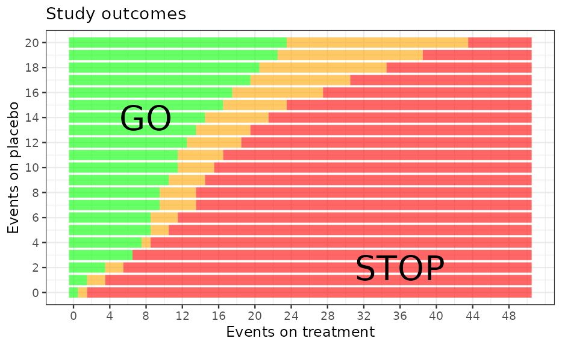

We can also use the design functions that were already derived
(`design_suc` and `design_fut`) to compute operating characteristics.

``` r
# Define the grid of true event rates for which to evaluate OC
p_trt <- seq(0, 0.5, length = 200)
p_pbo <- c(0.35, 0.40, 0.45, 0.50)

# Loop through the values for placebo and compute outcome probabilities
oc_list <- lapply(p_pbo, function(x) {
  p_go <- design_suc(p_trt, x)
  p_stop <- design_fut(p_trt, x)
  data.frame(p_trt, p_pbo = x, Go = p_go, Stop = p_stop, Indeterminate = 1 - p_go - p_stop)
})
# The above returns a list, so we bind the elements together into one data frame
oc <- bind_rows(oc_list)
# And convert from wide to long format
oc <- gather(oc, "Outcome", "Probability", 3:5)
oc$facet_text <- as.factor(paste("True placebo rate = ", oc$p_pbo, sep = ""))

# Finally we are ready to plot
ggplot(oc, aes(x = p_trt, y = Probability, colour = Outcome, linetype = Outcome)) +
  facet_wrap(~facet_text) +
  geom_line(size = 1) +
  scale_colour_manual(values = c("green", "orange", "red"), name = "Outcome") +
  scale_linetype(guide = FALSE) +
  geom_hline(yintercept = c(0.1, 0.8), linetype = 3) +
  scale_y_continuous(breaks = seq(0, 1, by = 0.2)) +
  labs(x = "True event rate for treatment", y = "Probability", title = "Operating Characteristics") +
  theme_bw(base_size = 12)
```

    ## Warning: The `guide` argument in `scale_*()` cannot be `FALSE`. This was deprecated in
    ## ggplot2 3.3.4.
    ## ℹ Please use "none" instead.
    ## This warning is displayed once per session.
    ## Call `lifecycle::last_lifecycle_warnings()` to see where this warning was
    ## generated.

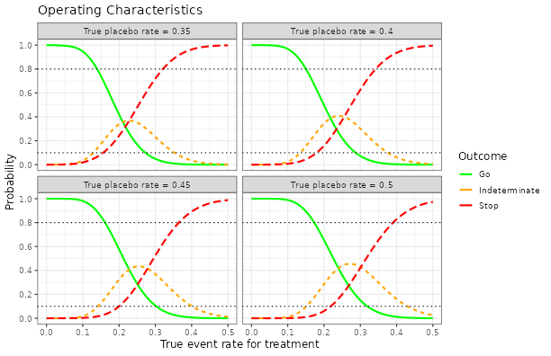

``` r
sessionInfo()
```

    ## R version 4.5.3 (2026-03-11)
    ## Platform: x86_64-pc-linux-gnu
    ## Running under: Ubuntu 24.04.3 LTS
    ## 
    ## Matrix products: default
    ## BLAS:   /usr/lib/x86_64-linux-gnu/openblas-pthread/libblas.so.3 
    ## LAPACK: /usr/lib/x86_64-linux-gnu/openblas-pthread/libopenblasp-r0.3.26.so;  LAPACK version 3.12.0
    ## 
    ## locale:
    ##  [1] LC_CTYPE=C.UTF-8       LC_NUMERIC=C           LC_TIME=C.UTF-8       
    ##  [4] LC_COLLATE=C.UTF-8     LC_MONETARY=C.UTF-8    LC_MESSAGES=C.UTF-8   
    ##  [7] LC_PAPER=C.UTF-8       LC_NAME=C              LC_ADDRESS=C          
    ## [10] LC_TELEPHONE=C         LC_MEASUREMENT=C.UTF-8 LC_IDENTIFICATION=C   
    ## 
    ## time zone: UTC
    ## tzcode source: system (glibc)
    ## 
    ## attached base packages:
    ## [1] stats     graphics  grDevices utils     datasets  methods   base     
    ## 
    ## other attached packages:
    ## [1] bayesplot_1.15.0 tidyr_1.3.2      dplyr_1.2.0      ggplot2_4.0.2   
    ## [5] knitr_1.51       RBesT_1.9-0     
    ## 
    ## loaded via a namespace (and not attached):
    ##  [1] tensorA_0.36.2.1      sass_0.4.10           generics_0.1.4       
    ##  [4] digest_0.6.39         magrittr_2.0.4        evaluate_1.0.5       
    ##  [7] grid_4.5.3            RColorBrewer_1.1-3    mvtnorm_1.3-5        
    ## [10] fastmap_1.2.0         jsonlite_2.0.0        pkgbuild_1.4.8       
    ## [13] backports_1.5.0       Formula_1.2-5         gridExtra_2.3        
    ## [16] purrr_1.2.1           QuickJSR_1.9.0        scales_1.4.0         
    ## [19] codetools_0.2-20      textshaping_1.0.5     jquerylib_0.1.4      
    ## [22] abind_1.4-8           cli_3.6.5             rlang_1.1.7          
    ## [25] withr_3.0.2           cachem_1.1.0          yaml_2.3.12          
    ## [28] otel_0.2.0            StanHeaders_2.32.10   parallel_4.5.3       
    ## [31] inline_0.3.21         rstan_2.32.7          tools_4.5.3          
    ## [34] rstantools_2.6.0      checkmate_2.3.4       assertthat_0.2.1     
    ## [37] vctrs_0.7.1           posterior_1.6.1       R6_2.6.1             
    ## [40] stats4_4.5.3          matrixStats_1.5.0     lifecycle_1.0.5      
    ## [43] fs_1.6.7              htmlwidgets_1.6.4     ragg_1.5.1           
    ## [46] pkgconfig_2.0.3       desc_1.4.3            pkgdown_2.2.0        
    ## [49] RcppParallel_5.1.11-2 bslib_0.10.0          pillar_1.11.1        
    ## [52] gtable_0.3.6          loo_2.9.0             glue_1.8.0           
    ## [55] Rcpp_1.1.1            systemfonts_1.3.2     xfun_0.56            
    ## [58] tibble_3.3.1          tidyselect_1.2.1      farver_2.1.2         
    ## [61] htmltools_0.5.9       labeling_0.4.3        rmarkdown_2.30       
    ## [64] compiler_4.5.3        S7_0.2.1              distributional_0.6.0
