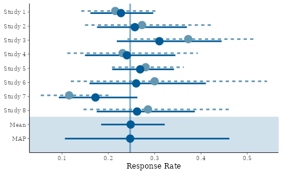
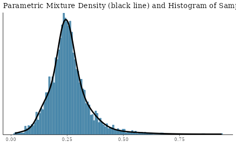
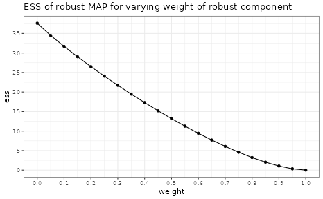
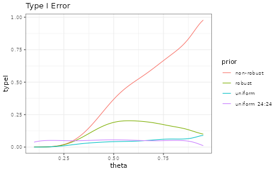
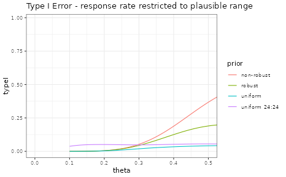
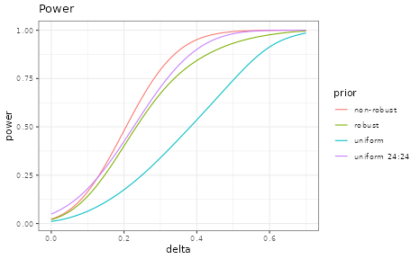
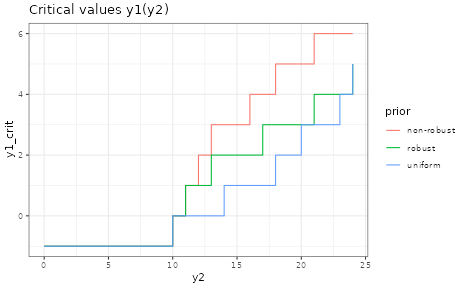

# Getting started with RBesT (binary)

## Introduction

The R Bayesian evidence synthesis Tools (RBesT) facilitate the use of
historical information in clinical trials. Once relevant historical
information has been identified, RBesT supports the derivation of
informative priors via the Meta-Analytic-Predictive (MAP) approach \[1\]
and the evaluation of the trial’s operating characteristics. The MAP
approach performs a standard meta-analysis followed by a prediction for
the control group parameter of a future study while accounting for the
uncertainty in the population mean (the standard result from a
meta-analysis) and the between-trial heterogeneity. Therefore, RBesT can
also be used as a meta-analysis tool if one simply neglects the
prediction part.

This document demonstrates RBesT as it can be used to derive from
historical control data a prior for a binary endpoint. The [RBesT
package homepage](https://opensource.nibr.com/RBesT/) contains further
articles on introductory material:

- Probability of success with co-data
- Probability of success at an interim with a normal endpoint
- Customizing RBesT plots
- RBesT for a normal endpoint
- Meta-Analytic-Predictive priors for variances

## Binary responder analysis example

Let’s consider a Novartis Phase II study in ankylosing spondylitis
comparing the Novartis test treatment secukinumab with placebo \[2\].
The primary efficacy endpoint was percentage of patients with a 20%
response according to the Assessment of SpondyloArthritis international
Society criteria for improvement (ASAS20) at week 6. For the control
group, the following historical data were used to derive the MAP prior:

| study   |   n |   r |
|:--------|----:|----:|
| Study 1 | 107 |  23 |
| Study 2 |  44 |  12 |
| Study 3 |  51 |  19 |
| Study 4 |  39 |   9 |
| Study 5 | 139 |  39 |
| Study 6 |  20 |   6 |
| Study 7 |  78 |   9 |
| Study 8 |  35 |  10 |

This dataset is part of RBesT and available after loading the package in
the data frame `AS`.

RBesT supports all required steps to design a clinical trial with
historical information using the MAP approach.

## Prior Derivation

### Meta-Analytic-Predictive Analysis

The **`gMAP`** function performs the meta-analysis and the prediction,
which yields the MAP prior. The analysis is run using stochastic
Markov-Chain-Monte-Carlo with Stan. In order to make results exactly
reproducible, the `set.seed` function must be called prior to calling
**`gMAP`** .

A key parameter in a meta-analysis is the between-trial heterogeneity
parameter $\tau$ which controls the amount of borrowing from historical
information for the estimation of the population mean will occur. As we
often have only few historical trials, the prior is important. For
binary endpoints with an expected response rate of 20%-80% we recommend
a conservative `HalfNormal(0,1)` prior as a default. Please refer to the
help-page of **`gMAP`** for more information.

The **`gMAP`** function returns an analysis object from which we can
extract information using the functions from RBesT. We do recommend to
look at the graphical model checks provided by RBesT as demonstrated
below. The most important one is the forest plot, with solid lines for
the MAP model predictions and dashed lines for the stratified estimates.
For a standard forest plot without the shrinkage estimates please refer
to the `forest_plot` function in RBesT.

``` r
# load R packages
library(RBesT)
library(ggplot2)
theme_set(theme_bw()) # sets up plotting theme

set.seed(34563)
map_mcmc <- gMAP(cbind(r, n - r) ~ 1 | study,
  data = AS,
  tau.dist = "HalfNormal",
  tau.prior = 1,
  beta.prior = 2,
  family = binomial
)
```

    ## Assuming default prior location   for beta: 0

``` r
print(map_mcmc)
```

    ## Generalized Meta Analytic Predictive Prior Analysis
    ## 
    ## Call:  gMAP(formula = cbind(r, n - r) ~ 1 | study, family = binomial, 
    ##     data = AS, tau.dist = "HalfNormal", tau.prior = 1, beta.prior = 2)
    ## 
    ## Exchangeability tau strata: 1 
    ## Prediction tau stratum    : 1 
    ## Maximal Rhat              : 1 
    ## 
    ## Between-trial heterogeneity of tau prediction stratum
    ##   mean     sd   2.5%    50%  97.5% 
    ## 0.3870 0.2150 0.0399 0.3590 0.8970 
    ## 
    ## MAP Prior MCMC sample
    ##   mean     sd   2.5%    50%  97.5% 
    ## 0.2550 0.0864 0.1060 0.2470 0.4610

``` r
## a graphical representation of model checks is available
pl <- plot(map_mcmc)

## a number of plots are immediately defined
names(pl)
```

    ## [1] "densityThetaStar"     "densityThetaStarLink" "forest_model"

``` r
## forest plot with model estimates
print(pl$forest_model)
```



An often raised concern with a Bayesian analysis is the choice of the
prior. Hence sensitivity analyses may sometimes be necessary. They can
be quickly performed with the **`update`** function. Suppose we want to
evaluate a more optimistic scenario (with less between-trial
heterogeneity), expressed by a `HalfNormal(0,1/2)` prior on $\tau$. Then
we can rerun the original analysis, but with modified arguments of
**`gMAP`**:

``` r
set.seed(36546)
map_mcmc_sens <- update(map_mcmc, tau.prior = 1 / 2)
```

    ## Assuming default prior location   for beta: 0

``` r
print(map_mcmc_sens)
```

    ## Generalized Meta Analytic Predictive Prior Analysis
    ## 
    ## Call:  gMAP(formula = cbind(r, n - r) ~ 1 | study, family = binomial, 
    ##     data = AS, tau.dist = "HalfNormal", tau.prior = 1/2, beta.prior = 2)
    ## 
    ## Exchangeability tau strata: 1 
    ## Prediction tau stratum    : 1 
    ## Maximal Rhat              : 1 
    ## 
    ## Between-trial heterogeneity of tau prediction stratum
    ##   mean     sd   2.5%    50%  97.5% 
    ## 0.3350 0.1720 0.0397 0.3200 0.7180 
    ## 
    ## MAP Prior MCMC sample
    ##   mean     sd   2.5%    50%  97.5% 
    ## 0.2590 0.0776 0.1290 0.2500 0.4420

### Parametric Approximation

As a next step, the MAP prior, represented numerically using a large
MCMC simulation sample, is converted to a parametric representation with
the **`automixfit`** function. This function fits a parametric mixture
representation using expectation-maximization (EM). The number of
mixture components to best describe the MAP is chosen automatically.
Again, the `plot` function produces a graphical diagnostic which allows
the user to assess whether the marginal mixture density (shown in black)
matches well with the histogram of the MAP MCMC sample.

``` r
map <- automixfit(map_mcmc)
print(map)
```

    ## EM for Beta Mixture Model
    ## Log-Likelihood = 4462.286
    ## 
    ## Univariate beta mixture
    ## Mixture Components:
    ##   comp1       comp2       comp3       comp4      
    ## w   0.4612914   0.1917812   0.1893896   0.1575378
    ## a  33.9513487  19.4400089  12.2692310   2.2521243
    ## b 103.0146367  41.5205219  55.9202833   5.4812202

``` r
plot(map)$mix
```



### Effective Sample Size

The (usual) intended use of a (MAP) prior is to reduce the number of
control patients in the trial. The prior can be considered equivalent to
a number of experimental observations, which is called the effective
sample size (ESS) of the prior. It can be calculated in RBesT with the
**`ess`** function. It should be noted, however, that the concept of ESS
is somewhat elusive. In particular, the definition of the ESS is not
unique and multiple methods have therefore been implemented in RBesT.
The default method in RBesT is the elir approach \[5\] which results in
reasonable ESS estimates. The moment matching approach leads to
conservative (small) ESS estimates while the Morita \[3\] method tends
to estimates liberal (large) ESS estimates when used with mixtures:

``` r
round(ess(map, method = "elir")) ## default method
```

    ## [1] 38

``` r
round(ess(map, method = "moment"))
```

    ## [1] 24

``` r
round(ess(map, method = "morita"))
```

    ## [1] 95

The Morita approach uses the curvature of the prior at the mode and has
been found to be sensitive to a large number of mixture components. From
experience, a realistic ESS estimate can be obtained with the elir
method which is the only method which is predictively consistent, see
\[5\] for details.

### Robustification of the MAP Prior

Finally, we recommend to **`robustify`** \[4\] the prior which protects
against type-I error inflation in presence of prior-data conflict,
i.e. if the future trial data strongly deviate from the historical
control information.

``` r
## add a 20% non-informative mixture component
map_robust <- robustify(map, weight = 0.2, mean = 1 / 2)
print(map_robust)
```

    ## Univariate beta mixture
    ## Mixture Components:
    ##   comp1       comp2       comp3       comp4       robust     
    ## w   0.3690331   0.1534249   0.1515117   0.1260303   0.2000000
    ## a  33.9513487  19.4400089  12.2692310   2.2521243   1.0000000
    ## b 103.0146367  41.5205219  55.9202833   5.4812202   1.0000000

``` r
round(ess(map_robust))
```

    ## [1] 27

Adding a robust mixture component does reduce the ESS of the MAP prior
to an extent which depends on the weight of the robust component.
Selecting higher robust mixture weights leads to greater discounting of
the informative MAP prior and vice versa. As a consequence the robust
weight controls the degree of influence of the MAP prior within the
final analysis. In some circumstances it can be helpful to graphically
illustrate the relationship of the prior ESS as a function of the robust
mixture component weight:

``` r
ess_weight <- data.frame(weight = seq(0.05, 0.95, by = 0.05), ess = NA)
for (i in seq_along(ess_weight$weight)) {
  ess_weight$ess[i] <- ess(robustify(map, ess_weight$weight[i], 0.5))
}
ess_weight <- rbind(
  ess_weight,
  data.frame(
    weight = c(0, 1),
    ess = c(ess(map), ess(mixbeta(c(1, 1, 1))))
  )
)

ggplot(ess_weight, aes(weight, ess)) +
  geom_point() +
  geom_line() +
  ggtitle("ESS of robust MAP for varying weight of robust component") +
  scale_x_continuous(breaks = seq(0, 1, by = 0.1)) +
  scale_y_continuous(breaks = seq(0, 40, by = 5))
```



## Design Evaluation

Now we have a prior which can be specified in the protocol. The
advantage of using historical information is the possible reduction of
the placebo patient group. The sample size of the control group is
supplemented by the historical information. The reduction in placebo
patients can be about as large as the ESS of the MAP prior.

In the following, we compare designs with different sample sizes and
priors for the control group. The comparisons are carried out by
evaluating standard Frequentist operating characteristics (type-I error,
power). The scenarios are not exhaustive, but rather specific ones to
demonstrate the use of RBesT for design evaluation.

### Operating Characteristics

We consider the 2-arm design of the actual Novartis trial in ankylosing
spondylitis \[2\]. This trial tested 6 patients on placebo as control
against 24 patients on an active experimental treatment. Success was
declared whenever the condition

$$\Pr\left( \theta_{active} - \theta_{control} > 0 \right) > 0.95$$

was met for the response rates $\theta_{active}$ and $\theta_{control}$.
A MAP prior was used for the placebo response rate parameter. Here we
evaluate a few design options as an example.

The operating characteristics are setup in RBesT in a stepwise manner:

1.  Definition of priors for each arm.
2.  Definition of the decision criterion using the **`decision2S`**
    function.
3.  Specification of design options with the **`oc2S`** function. This
    includes the overall decision function and per arm the prior and the
    sample size to use.
4.  The object from step 3 is then used to calculate the operating
    characteristics.

Note that for a 1-sample situation the respective `decision1S` and
`oc1S` function are used instead.

#### Type I Error

The type I can be increased compared to the nominal $\alpha$ level in
case of a conflict between the trial data and the prior. Note, that in
this example the MAP prior has a 95% interval of about 0.1 to 0.5.

``` r
theta <- seq(0.1, 0.95, by = 0.01)
uniform_prior <- mixbeta(c(1, 1, 1))
treat_prior <- mixbeta(c(1, 0.5, 1)) # prior for treatment used in trial
lancet_prior <- mixbeta(c(1, 11, 32)) # prior for control   used in trial
decision <- decision2S(0.95, 0, lower.tail = FALSE)

design_uniform <- oc2S(uniform_prior, uniform_prior, 24, 6, decision)
design_classic <- oc2S(uniform_prior, uniform_prior, 24, 24, decision)
design_nonrobust <- oc2S(treat_prior, map, 24, 6, decision)
design_robust <- oc2S(treat_prior, map_robust, 24, 6, decision)

typeI_uniform <- design_uniform(theta, theta)
typeI_classic <- design_classic(theta, theta)
typeI_nonrobust <- design_nonrobust(theta, theta)
typeI_robust <- design_robust(theta, theta)

ocI <- rbind(
  data.frame(theta = theta, typeI = typeI_robust, prior = "robust"),
  data.frame(theta = theta, typeI = typeI_nonrobust, prior = "non-robust"),
  data.frame(theta = theta, typeI = typeI_uniform, prior = "uniform"),
  data.frame(theta = theta, typeI = typeI_classic, prior = "uniform 24:24")
)

ggplot(ocI, aes(theta, typeI, colour = prior)) +
  geom_line() +
  ggtitle("Type I Error")
```



Note that observing response rates greater that 50% is highly
implausible based on the MAP analysis:

``` r
summary(map)
```

    ##       mean         sd       2.5%      50.0%      97.5% 
    ## 0.25545885 0.08662045 0.10730400 0.24758768 0.46276759

Hence, it is resonable to restrict the response rates $\theta$ for which
we evaluate the type I error to a a range of plausible values:

``` r
ggplot(ocI, aes(theta, typeI, colour = prior)) +
  geom_line() +
  ggtitle("Type I Error - response rate restricted to plausible range") +
  coord_cartesian(xlim = c(0, 0.5))
```



#### Power

The power demonstrates the gain of using an informative prior; i.e. 80%
power is reached for smaller $\delta$ values in comparison to a design
with non-informative priors for both arms.

``` r
delta <- seq(0, 0.7, by = 0.01)
mean_control <- summary(map)["mean"]
theta_active <- mean_control + delta
theta_control <- mean_control + 0 * delta

power_uniform <- design_uniform(theta_active, theta_control)
power_classic <- design_classic(theta_active, theta_control)
power_nonrobust <- design_nonrobust(theta_active, theta_control)
power_robust <- design_robust(theta_active, theta_control)

ocP <- rbind(
  data.frame(theta_active, theta_control, delta = delta, power = power_robust, prior = "robust"),
  data.frame(theta_active, theta_control, delta = delta, power = power_nonrobust, prior = "non-robust"),
  data.frame(theta_active, theta_control, delta = delta, power = power_uniform, prior = "uniform"),
  data.frame(theta_active, theta_control, delta = delta, power = power_classic, prior = "uniform 24:24")
)

ggplot(ocP, aes(delta, power, colour = prior)) +
  geom_line() +
  ggtitle("Power")
```



We see that with the MAP prior one reaches greater power at smaller
differences $\delta$ in the response rate. For example, the $\delta$ for
which 80% power is reached can be found with:

``` r
find_delta <- function(design, theta_control, target_power) {
  uniroot(
    function(delta) {
      design(theta_control + delta, theta_control) - target_power
    },
    interval = c(0, 1 - theta_control)
  )$root
}

target_effect <- data.frame(
  delta = c(
    find_delta(design_nonrobust, mean_control, 0.8),
    find_delta(design_classic, mean_control, 0.8),
    find_delta(design_robust, mean_control, 0.8),
    find_delta(design_uniform, mean_control, 0.8)
  ),
  prior = c("non-robust", "uniform 24:24", "robust", "uniform")
)

knitr::kable(target_effect, digits = 3)
```

| delta | prior         |
|------:|:--------------|
| 0.302 | non-robust    |
| 0.341 | uniform 24:24 |
| 0.368 | robust        |
| 0.529 | uniform       |

#### Data Scenarios

An alternative approach to visualize the study design to
non-statisticians is by considering data scenarios. These show the
decisions based on potential trial outcomes. The information needed are
the critical values at which the decision criterion flips. In the
2-sample case this means to calculate the decision boundary, see the
**`decision2S_boundary`** help for more information.

``` r
## Critical values at which the decision flips are given conditional
## on the outcome of the second read-out; as we like to have this as a
## function of the treatment group outcome, we flip label 1 and 2
decision_flipped <- decision2S(0.95, 0, lower.tail = TRUE)
crit_uniform <- decision2S_boundary(uniform_prior, uniform_prior, 6, 24, decision_flipped)
crit_nonrobust <- decision2S_boundary(map, treat_prior, 6, 24, decision_flipped)
crit_robust <- decision2S_boundary(map_robust, treat_prior, 6, 24, decision_flipped)
treat_y2 <- 0:24
## Note that -1 is returned to indicated that the decision is never 1
ocC <- rbind(
  data.frame(y2 = treat_y2, y1_crit = crit_robust(treat_y2), prior = "robust"),
  data.frame(y2 = treat_y2, y1_crit = crit_nonrobust(treat_y2), prior = "non-robust"),
  data.frame(y2 = treat_y2, y1_crit = crit_uniform(treat_y2), prior = "uniform")
)

ggplot(ocC, aes(y2, y1_crit, colour = prior)) +
  geom_step() +
  ggtitle("Critical values y1(y2)")
```



The graph shows that the decision will always be negative if there are
less than 10 events in the treatment group. On the other hand, under a
non-robust prior and assuming 15 events in the treatment group, three
(or less) placebo events would be needed for success. To check this
result, we can directly evaluate the decision function:

``` r
## just positive
decision(postmix(treat_prior, n = 24, r = 15), postmix(map, n = 6, r = 3))
```

    ## [1] 1

``` r
## negative
decision(postmix(treat_prior, n = 24, r = 14), postmix(map, n = 6, r = 4))
```

    ## [1] 0

## Trial Analysis

Once the trial has completed and data is collected, the final analysis
can be run with RBesT using the **`postmix`** function. Calculations are
performed analytically as we are in the conjugate mixture setting.

``` r
r_placebo <- 1
r_treat <- 14

## first obtain posterior distributions...
post_placebo <- postmix(map_robust, r = r_placebo, n = 6)
post_treat <- postmix(treat_prior, r = r_treat, n = 24)

## ...then calculate probability that the difference is smaller than
## zero
prob_smaller <- pmixdiff(post_treat, post_placebo, 0, lower.tail = FALSE)

prob_smaller
```

    ## [1] 0.9917197

``` r
prob_smaller > 0.95
```

    ## [1] TRUE

``` r
## alternativley we can use the decision object
decision(post_treat, post_placebo)
```

    ## [1] 1

#### References

\[1\] Neuenschwander B. et al., *Clin Trials*. 2010; 7(1):5-18  
\[2\] Baeten D. et al., *The Lancet*, 2013, (382), 9906, p 1705  
\[3\] Morita S. et al., *Biometrics* 2008;64(2):595-602  
\[4\] Schmidli H. et al., *Biometrics* 2014;70(4):1023-1032  
\[5\] Neuenschwander B. et al., *Biometrics* 2020;76(2):578-587

#### R Session Info

``` r
sessionInfo()
```

    ## R version 4.5.3 (2026-03-11)
    ## Platform: x86_64-pc-linux-gnu
    ## Running under: Ubuntu 24.04.3 LTS
    ## 
    ## Matrix products: default
    ## BLAS:   /usr/lib/x86_64-linux-gnu/openblas-pthread/libblas.so.3 
    ## LAPACK: /usr/lib/x86_64-linux-gnu/openblas-pthread/libopenblasp-r0.3.26.so;  LAPACK version 3.12.0
    ## 
    ## locale:
    ##  [1] LC_CTYPE=C.UTF-8       LC_NUMERIC=C           LC_TIME=C.UTF-8       
    ##  [4] LC_COLLATE=C.UTF-8     LC_MONETARY=C.UTF-8    LC_MESSAGES=C.UTF-8   
    ##  [7] LC_PAPER=C.UTF-8       LC_NAME=C              LC_ADDRESS=C          
    ## [10] LC_TELEPHONE=C         LC_MEASUREMENT=C.UTF-8 LC_IDENTIFICATION=C   
    ## 
    ## time zone: UTC
    ## tzcode source: system (glibc)
    ## 
    ## attached base packages:
    ## [1] stats     graphics  grDevices utils     datasets  methods   base     
    ## 
    ## other attached packages:
    ## [1] ggplot2_4.0.2 knitr_1.51    RBesT_1.9-0  
    ## 
    ## loaded via a namespace (and not attached):
    ##  [1] gtable_0.3.6          tensorA_0.36.2.1      xfun_0.56            
    ##  [4] bslib_0.10.0          QuickJSR_1.9.0        htmlwidgets_1.6.4    
    ##  [7] inline_0.3.21         vctrs_0.7.1           tools_4.5.3          
    ## [10] generics_0.1.4        stats4_4.5.3          parallel_4.5.3       
    ## [13] tibble_3.3.1          pkgconfig_2.0.3       checkmate_2.3.4      
    ## [16] RColorBrewer_1.1-3    S7_0.2.1              desc_1.4.3           
    ## [19] distributional_0.6.0  RcppParallel_5.1.11-2 assertthat_0.2.1     
    ## [22] lifecycle_1.0.5       compiler_4.5.3        farver_2.1.2         
    ## [25] stringr_1.6.0         textshaping_1.0.5     codetools_0.2-20     
    ## [28] htmltools_0.5.9       sass_0.4.10           bayesplot_1.15.0     
    ## [31] yaml_2.3.12           Formula_1.2-5         pillar_1.11.1        
    ## [34] pkgdown_2.2.0         jquerylib_0.1.4       cachem_1.1.0         
    ## [37] StanHeaders_2.32.10   abind_1.4-8           posterior_1.6.1      
    ## [40] rstan_2.32.7          tidyselect_1.2.1      digest_0.6.39        
    ## [43] mvtnorm_1.3-5         stringi_1.8.7         dplyr_1.2.0          
    ## [46] reshape2_1.4.5        labeling_0.4.3        fastmap_1.2.0        
    ## [49] grid_4.5.3            cli_3.6.5             magrittr_2.0.4       
    ## [52] loo_2.9.0             pkgbuild_1.4.8        withr_3.0.2          
    ## [55] scales_1.4.0          backports_1.5.0       rmarkdown_2.30       
    ## [58] matrixStats_1.5.0     otel_0.2.0            gridExtra_2.3        
    ## [61] ragg_1.5.1            evaluate_1.0.5        rstantools_2.6.0     
    ## [64] rlang_1.1.7           Rcpp_1.1.1            glue_1.8.0           
    ## [67] jsonlite_2.0.0        R6_2.6.1              plyr_1.8.9           
    ## [70] systemfonts_1.3.2     fs_1.6.7
