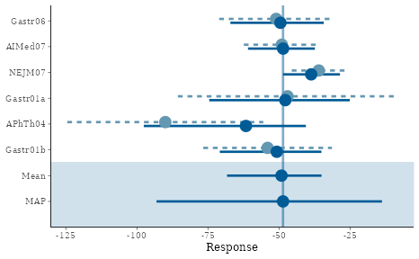
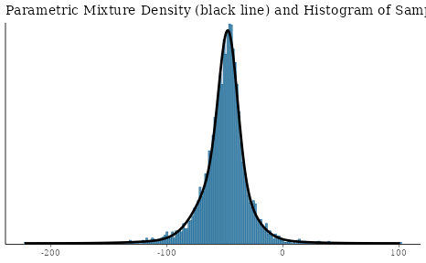
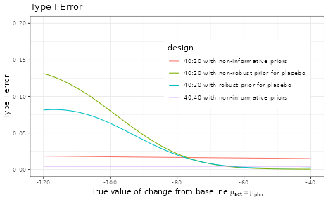
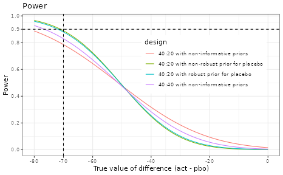

# RBesT for a Normal Endpoint

## Introduction

The R Bayesian evidence synthesis Tools (RBesT) have been created to
facilitate the use of historical information in clinical trials. Once
relevant historical information has been identified, RBesT supports the
derivation of informative priors via the Meta-Analytic-Predictive (MAP)
approach \[1\], the evaluation of the trial’s operating characteristics,
and the data analysis with the actual trial data. RBesT has been
developed for endpoints from a number of well known distributions. Here
we consider an example for a normally distributed response variable.

## Trial Design with Historical Control Data

### Historical Data

Let’s look at the Crohn’s disease example data \[2\] (data-set `crohn`
in RBesT). The primary endpoint is the change from baseline in Crohn’s
Disease Activity Index (CDAI), which is assumed to be normally
distributed. Note that for CDAI, an improved outcome corresponds to a
negative change from baseline.

First from historical studies we get the estimated standard deviation of
the response variable as $\sigma$ = 88, which is used to obtain the
standard errors of the effect estimates.

``` r
dat <- crohn
crohn_sigma <- 88
dat$y.se <- crohn_sigma / sqrt(dat$n)
```

| study    |   n |   y |  y.se |
|:---------|----:|----:|------:|
| Gastr06  |  74 | -51 | 10.23 |
| AIMed07  | 166 | -49 |  6.83 |
| NEJM07   | 328 | -36 |  4.86 |
| Gastr01a |  20 | -47 | 19.68 |
| APhTh04  |  25 | -90 | 17.60 |
| Gastr01b |  58 | -54 | 11.55 |

### Derivation of MAP Prior

The MAP prior can be derived with the function **`gMAP`**. The
between-trial heterogeneity parameter $\tau$ governs how much
information will be shared from the historical trials into the design
and analysis of the future trials. In the normal case with a known
sampling standard deviation $\sigma$, the amount of borrowing from
historical data depends on the ratio $\tau/\sigma$. A conservative
choice for the prior on $\tau$ is a **`HalfNormal(0,`**
$\sigma/2$**`)`** distribution. For the prior on the intercept we
recommend a “unit-information” prior \[3\] which is set to a precision
corresponding to a single observation and centered here at no change
from baseline. Please refer to the help page
**[`?gMAP`](https://opensource.nibr.com/RBesT/reference/gMAP.md)** for
detailed information. The **`set.seed`** function is used to make the
results exactly reproducible.

``` r
library(RBesT)
set.seed(689654)
map_mcmc <- gMAP(cbind(y, y.se) ~ 1 | study,
  weights = n, data = dat,
  family = gaussian,
  beta.prior = cbind(0, crohn_sigma),
  tau.dist = "HalfNormal", tau.prior = cbind(0, crohn_sigma / 2)
)
print(map_mcmc)
```

    ## Generalized Meta Analytic Predictive Prior Analysis
    ## 
    ## Call:  gMAP(formula = cbind(y, y.se) ~ 1 | study, family = gaussian, 
    ##     data = dat, weights = n, tau.dist = "HalfNormal", tau.prior = cbind(0, 
    ##         crohn_sigma/2), beta.prior = cbind(0, crohn_sigma))
    ## 
    ## Exchangeability tau strata: 1 
    ## Prediction tau stratum    : 1 
    ## Maximal Rhat              : 1 
    ## Estimated reference scale : 88 
    ## 
    ## Between-trial heterogeneity of tau prediction stratum
    ##  mean    sd  2.5%   50% 97.5% 
    ## 14.30  9.99  1.35 12.20 38.40 
    ## 
    ## MAP Prior MCMC sample
    ##  mean    sd  2.5%   50% 97.5% 
    ## -50.0  19.3 -93.1 -48.6 -13.8

``` r
## a graphical representation is also available
pl <- plot(map_mcmc)

## a number of plots are immediately defined
names(pl)
```

    ## [1] "densityThetaStar"     "densityThetaStarLink" "forest_model"

``` r
## forest plot with model estimates
print(pl$forest_model)
```



### Approximation of MAP Prior using a Mixture Distribution

Next, the MCMC MAP prior from the previous section is converted to a
parametric representation with the **`automixfit`** function. This
function fits a parametric mixture representation using
expectation-maximization (EM). The number of mixture components is
chosen automatically using AIC. One can also specify the number of
components for the mixture via **`mixfit`** function and compare with
the **`automixfit`** outcome.

``` r
map <- automixfit(map_mcmc)
print(map)
```

    ## EM for Normal Mixture Model
    ## Log-Likelihood = -17062.45
    ## 
    ## Univariate normal mixture
    ## Reference scale: 88
    ## Mixture Components:
    ##   comp1        comp2        comp3       
    ## w   0.50104846   0.41871594   0.08023561
    ## m -51.42408665 -47.25917128 -55.07086416
    ## s  19.04525409   7.85193726  44.57325000

``` r
## check accuracy of mixture fit
plot(map)$mix
```



### Effective Sample Size (ESS)

The main advantage of using historical information is the possibility to
reduce the number of control patients, as the informative prior is
effectively equivalent to a certain number of control patients. This is
called the effective sample size (ESS) and can be calculated in RBesT
with the **`ess`** function.

In the study protocol of this Crohn’s disease data example, the very
conservative moment-based ESS of 20 was used to reduce the planned
sample size of the control group.

``` r
round(ess(map)) ## default elir method
```

    ## Using default prior reference scale 88

    ## [1] 39

``` r
round(ess(map, method = "morita"))
```

    ## Using default prior reference scale 88

    ## [1] 89

``` r
round(ess(map, method = "moment"))
```

    ## Using default prior reference scale 88

    ## [1] 21

### Robustification of MAP Prior

We recommend robustifying \[5\] the prior with the **`robustify`**
function, which protects against type-I error inflation in presence of
prior-data conflict. For the normal case we strongly recommend
explicitly choosing the mean of the robust component. We use $- 50$
consistent with the mean of the MAP prior. Furthermore, 20% probability
is used for the additional robust (unit-information) mixture component.
The choice of such probability reflects the confidence about the
validitiy of the model assumptions, i.e. the possibility of a
non-exchangable control group to be enrolled per inclusion/exclusion
criteria in the current trial as compared to the historical control
group population. Note that robustification decreases the ESS.

``` r
## add a 20% non-informative mixture component
map_robust <- robustify(map, weight = 0.2, mean = -50)
```

    ## Using default prior reference scale 88

``` r
print(map_robust)
```

    ## Univariate normal mixture
    ## Reference scale: 88
    ## Mixture Components:
    ##   comp1        comp2        comp3        robust      
    ## w   0.40083877   0.33497275   0.06418848   0.20000000
    ## m -51.42408665 -47.25917128 -55.07086416 -50.00000000
    ## s  19.04525409   7.85193726  44.57325000  88.00000000

``` r
round(ess(map_robust))
```

    ## Using default prior reference scale 88

    ## [1] 28

### Operating Characteristics of Design Options

Typically, operating characteristics are required to evaluate the
proposed design or compare a few design options. RBesT requires the
input of decision rules via **`decision2S`** function and then
calculates the operating characteristics with the **`oc2S`** function.
The calculation is expedited based on analytic expressions. In the
following we compare a few design options, which differ in the choice of
the control priors and the sample size of the control group for the
planned trial. There may be other design factors (such as the outcome
standard deviation), which should be considered when comparing design
options. Such factors are not considered here for simplicity purpose.

#### Decision Rules

Consider this 2-arm design of placebo (with an informative prior)
against an experimental treatment. The dual-criterion for success is
defined as follows: $$\begin{array}{rlr}
\text{Criterion 1:} & {\Pr\left( \theta_{act} - \theta_{pbo} < 0 \right)} & {> 0.95} \\
\text{Criterion 2:} & {\Pr\left( \theta_{act} - \theta_{pbo} < - 50 \right)} & {> 0.50.}
\end{array}$$

Equivalently, the second criterion requires that the posterior median
difference exceeds -50. The dual-criteria account for statistical
significance as well as clinical relevance. Note that a negative change
from baseline in CDAI corresponds to improvement.

``` r
## dual decision criteria
## pay attention to "lower.tail" argument and the order of active and pbo
poc <- decision2S(pc = c(0.95, 0.5), qc = c(0, -50), lower.tail = TRUE)
print(poc)
```

    ## 2 sample decision function
    ## Conditions for acceptance:
    ## P(theta1 - theta2 <= 0) > 0.95
    ## P(theta1 - theta2 <= -50) > 0.5
    ## Link: identity

#### Design Options

For the active group we use the same weakly informative
(unit-information) prior as used in the robustification step of the MAP
prior. Also, we set up the few design options with different choices of
control prior and different sizes of control group.

``` r
## set up prior for active group
weak_prior <- mixnorm(c(1, -50, 1), sigma = crohn_sigma, param = "mn")
n_act <- 40
n_pbo <- 20

## four designs
## "b" means a balanced design, 1:1
## "ub" means 40 in active and 20 in placebo
design_noprior_b <- oc2S(weak_prior, weak_prior, n_act, n_act, poc,
  sigma1 = crohn_sigma, sigma2 = crohn_sigma
)
design_noprior_ub <- oc2S(weak_prior, weak_prior, n_act, n_pbo, poc,
  sigma1 = crohn_sigma, sigma2 = crohn_sigma
)
design_nonrob_ub <- oc2S(weak_prior, map, n_act, n_pbo, poc,
  sigma1 = crohn_sigma, sigma2 = crohn_sigma
)
design_rob_ub <- oc2S(weak_prior, map_robust, n_act, n_pbo, poc,
  sigma1 = crohn_sigma, sigma2 = crohn_sigma
)
```

#### Type I Error

The type I can be increased compared to the nominal $\alpha$ level in
case of a conflict between the trial data and the prior. The robustified
MAP prior can reduce the type I error inflation in this case to a lower
level.

``` r
# the range for true values
cfb_truth <- seq(-120, -40, by = 1)

typeI1 <- design_noprior_b(cfb_truth, cfb_truth)
typeI2 <- design_noprior_ub(cfb_truth, cfb_truth)
typeI3 <- design_nonrob_ub(cfb_truth, cfb_truth)
typeI4 <- design_rob_ub(cfb_truth, cfb_truth)

ocI <- rbind(
  data.frame(
    cfb_truth = cfb_truth, typeI = typeI1,
    design = "40:40 with non-informative priors"
  ),
  data.frame(
    cfb_truth = cfb_truth, typeI = typeI2,
    design = "40:20 with non-informative priors"
  ),
  data.frame(
    cfb_truth = cfb_truth, typeI = typeI3,
    design = "40:20 with non-robust prior for placebo"
  ),
  data.frame(
    cfb_truth = cfb_truth, typeI = typeI4,
    design = "40:20 with robust prior for placebo"
  )
)
ggplot(ocI, aes(cfb_truth, typeI, colour = design)) +
  geom_line() +
  ggtitle("Type I Error") +
  xlab(expression(paste("True value of change from baseline ", mu[act] == mu[pbo]))) +
  ylab("Type I error") +
  coord_cartesian(ylim = c(0, 0.2)) +
  theme(legend.justification = c(1, 1), legend.position = c(0.95, 0.85))
```



#### Power

The power shows the gain of using an informative prior for the control
arm; i.e. 90% power is reached for smaller $\delta$ values compared to
the design with weakly informative priors for both arms or the balanced
design.

``` r
delta <- seq(-80, 0, by = 1)
m <- summary(map)["mean"]
cfb_truth1 <- m + delta # active for 1
cfb_truth2 <- m + 0 * delta # pbo for 2

power1 <- design_noprior_b(cfb_truth1, cfb_truth2)
power2 <- design_noprior_ub(cfb_truth1, cfb_truth2)
power3 <- design_nonrob_ub(cfb_truth1, cfb_truth2)
power4 <- design_rob_ub(cfb_truth1, cfb_truth2)

ocP <- rbind(
  data.frame(
    cfb_truth1 = cfb_truth1, cfb_truth2 = cfb_truth2,
    delta = delta, power = power1,
    design = "40:40 with non-informative priors"
  ),
  data.frame(
    cfb_truth1 = cfb_truth1, cfb_truth2 = cfb_truth2,
    delta = delta, power = power2,
    design = "40:20 with non-informative priors"
  ),
  data.frame(
    cfb_truth1 = cfb_truth1, cfb_truth2 = cfb_truth2,
    delta = delta, power = power3,
    design = "40:20 with non-robust prior for placebo"
  ),
  data.frame(
    cfb_truth1 = cfb_truth1, cfb_truth2 = cfb_truth2,
    delta = delta, power = power4,
    design = "40:20 with robust prior for placebo"
  )
)

ggplot(ocP, aes(delta, power, colour = design)) +
  geom_line() +
  ggtitle("Power") +
  xlab("True value of difference (act - pbo)") +
  ylab("Power") +
  scale_y_continuous(breaks = c(seq(0, 1, 0.2), 0.9)) +
  scale_x_continuous(breaks = c(seq(-80, 0, 20), -70)) +
  geom_hline(yintercept = 0.9, linetype = 2) +
  geom_vline(xintercept = -70, linetype = 2) +
  theme(legend.justification = c(1, 1), legend.position = c(0.95, 0.85))
```



## Final Analysis with Trial Data

When the actual trial data are available, the final analysis can be run
with RBesT via the **`postmix`** function. The real data are used for
this example, where the trial data led to a negative conclusion.
However, note that **`postmix`** assumes that the sampling standard
deviation is known and fixed. Therefore, no uncertainty in its estimate
is taken into account.

``` r
## one can either use summary data or individual data. See ?postmix.
y.act <- -29.2
y.act.se <- 14.0
n.act <- 39

y.pbo <- -63.1
y.pbo.se <- 13.9
n.pbo <- 20

## first obtain posterior distributions
post_act <- postmix(weak_prior, m = y.act, se = y.act.se)
post_pbo <- postmix(map_robust, m = y.pbo, se = y.pbo.se)

## then calculate probability for the dual criteria
## and compare to the predefined threshold values
p1 <- pmixdiff(post_act, post_pbo, 0)
print(p1)
```

    ## [1] 0.06270104

``` r
p2 <- pmixdiff(post_act, post_pbo, -50)
print(p2)
```

    ## [1] 3.827361e-06

``` r
print(p1 > 0.95 & p2 > 0.5)
```

    ## [1] FALSE

``` r
## or we can use the decision function
poc(post_act, post_pbo)
```

    ## [1] 0

#### References

\[1\] Neuenschwander B et. al, *Clin Trials*. 2010; 7(1):5-18  
\[2\] Hueber W. et. al, *Gut*, 2012, 61(12):1693-1700  
\[3\] Kass RE, Wasserman L, *J Amer Statist Assoc*; 1995,
90(431):928-934.  
\[4\] Morita S. et. al, *Biometrics* 2008;64(2):595-602  
\[5\] Schmidli H. et. al, *Biometrics* 2014;70(4):1023-1032

#### R Session Info

``` r
sessionInfo()
```

    ## R version 4.5.3 (2026-03-11)
    ## Platform: x86_64-pc-linux-gnu
    ## Running under: Ubuntu 24.04.3 LTS
    ## 
    ## Matrix products: default
    ## BLAS:   /usr/lib/x86_64-linux-gnu/openblas-pthread/libblas.so.3 
    ## LAPACK: /usr/lib/x86_64-linux-gnu/openblas-pthread/libopenblasp-r0.3.26.so;  LAPACK version 3.12.0
    ## 
    ## locale:
    ##  [1] LC_CTYPE=C.UTF-8       LC_NUMERIC=C           LC_TIME=C.UTF-8       
    ##  [4] LC_COLLATE=C.UTF-8     LC_MONETARY=C.UTF-8    LC_MESSAGES=C.UTF-8   
    ##  [7] LC_PAPER=C.UTF-8       LC_NAME=C              LC_ADDRESS=C          
    ## [10] LC_TELEPHONE=C         LC_MEASUREMENT=C.UTF-8 LC_IDENTIFICATION=C   
    ## 
    ## time zone: UTC
    ## tzcode source: system (glibc)
    ## 
    ## attached base packages:
    ## [1] stats     graphics  grDevices utils     datasets  methods   base     
    ## 
    ## other attached packages:
    ## [1] ggplot2_4.0.2 knitr_1.51    RBesT_1.9-0  
    ## 
    ## loaded via a namespace (and not attached):
    ##  [1] gtable_0.3.6          tensorA_0.36.2.1      xfun_0.56            
    ##  [4] bslib_0.10.0          QuickJSR_1.9.0        htmlwidgets_1.6.4    
    ##  [7] inline_0.3.21         vctrs_0.7.1           tools_4.5.3          
    ## [10] generics_0.1.4        stats4_4.5.3          parallel_4.5.3       
    ## [13] tibble_3.3.1          pkgconfig_2.0.3       checkmate_2.3.4      
    ## [16] RColorBrewer_1.1-3    S7_0.2.1              desc_1.4.3           
    ## [19] distributional_0.6.0  RcppParallel_5.1.11-2 assertthat_0.2.1     
    ## [22] lifecycle_1.0.5       compiler_4.5.3        farver_2.1.2         
    ## [25] stringr_1.6.0         textshaping_1.0.5     codetools_0.2-20     
    ## [28] htmltools_0.5.9       sass_0.4.10           bayesplot_1.15.0     
    ## [31] yaml_2.3.12           Formula_1.2-5         pillar_1.11.1        
    ## [34] pkgdown_2.2.0         jquerylib_0.1.4       cachem_1.1.0         
    ## [37] StanHeaders_2.32.10   abind_1.4-8           posterior_1.6.1      
    ## [40] rstan_2.32.7          tidyselect_1.2.1      digest_0.6.39        
    ## [43] mvtnorm_1.3-5         stringi_1.8.7         dplyr_1.2.0          
    ## [46] reshape2_1.4.5        labeling_0.4.3        fastmap_1.2.0        
    ## [49] grid_4.5.3            cli_3.6.5             magrittr_2.0.4       
    ## [52] loo_2.9.0             pkgbuild_1.4.8        withr_3.0.2          
    ## [55] scales_1.4.0          backports_1.5.0       rmarkdown_2.30       
    ## [58] matrixStats_1.5.0     otel_0.2.0            gridExtra_2.3        
    ## [61] ragg_1.5.1            evaluate_1.0.5        rstantools_2.6.0     
    ## [64] rlang_1.1.7           Rcpp_1.1.1            glue_1.8.0           
    ## [67] jsonlite_2.0.0        R6_2.6.1              plyr_1.8.9           
    ## [70] systemfonts_1.3.2     fs_1.6.7
