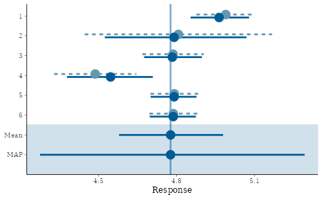
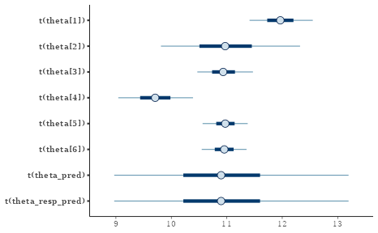
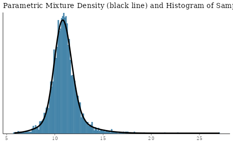
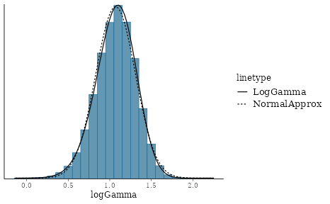
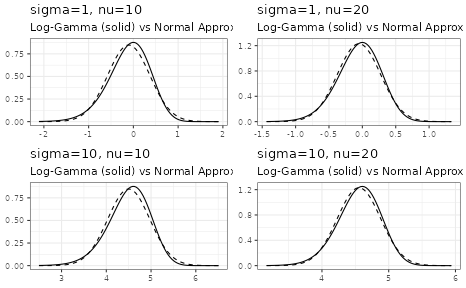
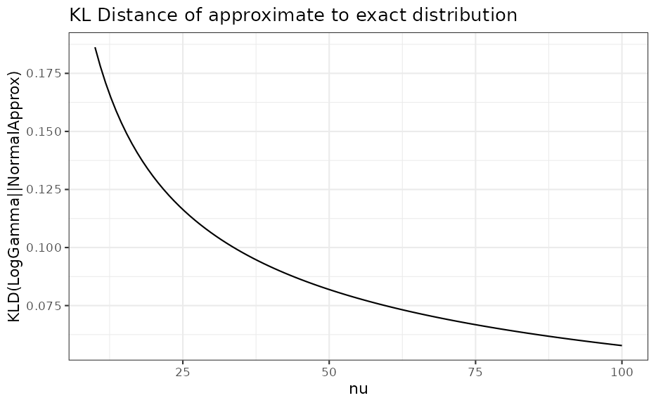

# Meta-Analytic-Predictive Priors for Variances

Applying the meta-analytic-predictive (MAP) prior approach to historical
data on variances has been suggested in \[1\]. The utility is a better
informed planning of future trials which use a normal endpoint. For
these reliable information on the sampling standard deviation is crucial
for planning the trial.

Under a normal sampling distribution the (standard) unbiased variance
estimator for a sample $y_{j}$ of size $n_{j}$ is

$$s_{j}^{2} = \frac{1}{n_{j} - 1}\sum\limits_{i = 1}^{n_{j}}\left( y_{j,i} - {\bar{y}}_{j} \right)^{2},$$

which follows a $\chi_{\nu}^{2}$ distribution with $\nu_{j} = n_{j} - 1$
degrees of freedom. The $\chi_{\nu}^{2}$ can be rewritten as a $\Gamma$
distribution

$$s_{j}^{2}|\nu_{j},\sigma_{j} \sim \Gamma\left( \nu_{j}/2,\nu_{j}/\left( 2\,\sigma_{j}^{2} \right) \right)$$$$\left. \Leftrightarrow s_{j}^{2}\,\nu_{j}/2|\nu_{j},\sigma_{j} \sim \Gamma\left( \nu_{j}/2,1/\sigma_{j}^{2} \right), \right.$$

where $\sigma_{j}$ is the (unknown) sampling standard deviation for the
data $y_{j}$.

While this is not directly supported in `RBesT`, a normal approximation
of the $\log$ transformed $\Gamma$ variate can be applied. When $\log$
transforming a $\Gamma(\alpha,\beta)$ variate it’s moment and variance
can analytically be shown to be (see \[2\], for example)

$$E\left\lbrack \log(X) \right\rbrack = \psi(\alpha) - \log(\beta)$$$$Var\left\lbrack \log(X) \right\rbrack = \psi^{(1)}(\alpha).$$

Here, $\psi(x)$ is the digamma function and $\psi^{(1)}(x)$ is the
polygamma function of order 1 (second derivative of the $\log$ of the
$\Gamma$ function).

Thus, by approximating the $\log$ transformed $\Gamma$ distribution with
a normal approximation, we can apply `gMAP` as if we were using a normal
endpoint. Specifically, we apply the transform
$Y_{j} = \log\left( s_{j}^{2}\,\nu_{j}/2 \right) - \psi\left( \nu_{j}/2 \right)$
such that the meta-analytic model directly considers $\log\sigma_{j}$ as
random variate. The normal approximation becomes more accurate, the
larger the degrees of freedom are. The section at the bottom of this
vignette discusses this approximation accuracy and concludes that
independent of the true $\sigma$ value for 10 observations the
approxmation is useful and a very good one for more than 20
observations.

In the following we reanalyze the main example of reference \[1\] which
is shown in table 2:

| study |    sd |  df |
|------:|------:|----:|
|     1 | 12.11 | 597 |
|     2 | 10.97 |  60 |
|     3 | 10.94 | 548 |
|     4 |  9.41 | 307 |
|     5 | 10.97 | 906 |
|     6 | 10.95 | 903 |

Using the above equations (and using plug-in estimates for $\sigma_{j}$)
this translates into an approximate normal distribution for the $\log$
variance as:

``` r
hdata <- mutate(hdata,
  alpha = df / 2,
  beta = alpha / sd^2,
  logvar_mean = log(sd^2 * alpha) - digamma(alpha),
  logvar_var = psigamma(alpha, 1)
)
```

| study |    sd |  df | alpha |   beta | logvar_mean | logvar_var |
|------:|------:|----:|------:|-------:|------------:|-----------:|
|     1 | 12.11 | 597 | 298.5 | 2.0354 |      4.9897 |     0.0034 |
|     2 | 10.97 |  60 |  30.0 | 0.2493 |      4.8071 |     0.0339 |
|     3 | 10.94 | 548 | 274.0 | 2.2894 |      4.7867 |     0.0037 |
|     4 |  9.41 | 307 | 153.5 | 1.7335 |      4.4868 |     0.0065 |
|     5 | 10.97 | 906 | 453.0 | 3.7643 |      4.7914 |     0.0022 |
|     6 | 10.95 | 903 | 451.5 | 3.7656 |      4.7878 |     0.0022 |

In order to run the MAP analysis a prior for the heterogeniety parameter
$\tau$ and the intercept $\beta$ is needed. In reference \[3\] it is
demonstrated that the (approximate) sampling standard deviation of the
$\log$ variance is $\sqrt{2}$. Thus, a `HalfNormal(0,sqrt(2)/2)` is a
very conservative choice for the between-study heterogeniety parameter.
A less conservative choice is `HalfNormal(0,sqrt(2)/4)`, which gives
very similar results in this case. For the intercept $\beta$ a very wide
prior is used with a standard deviation of $100$ which is in line with
reference \[1\]:

``` r
map_mc <- gMAP(cbind(logvar_mean, sqrt(logvar_var)) ~ 1 | study,
  data = hdata,
  tau.dist = "HalfNormal", tau.prior = sqrt(2) / 2,
  beta.prior = cbind(4.8, 100)
)


map_mc
```

    ## Generalized Meta Analytic Predictive Prior Analysis
    ## 
    ## Call:  gMAP(formula = cbind(logvar_mean, sqrt(logvar_var)) ~ 1 | study, 
    ##     data = hdata, tau.dist = "HalfNormal", tau.prior = sqrt(2)/2, 
    ##     beta.prior = cbind(4.8, 100))
    ## 
    ## Exchangeability tau strata: 1 
    ## Prediction tau stratum    : 1 
    ## Maximal Rhat              : 1 
    ## 
    ## Between-trial heterogeneity of tau prediction stratum
    ##   mean     sd   2.5%    50%  97.5% 
    ## 0.2020 0.1020 0.0758 0.1810 0.4710 
    ## 
    ## MAP Prior MCMC sample
    ##  mean    sd  2.5%   50% 97.5% 
    ## 4.780 0.247 4.270 4.780 5.290

``` r
summary(map_mc)
```

    ## Heterogeneity parameter tau per stratum:
    ##         mean    sd   2.5%   50% 97.5%
    ## tau[1] 0.202 0.102 0.0758 0.181 0.471
    ## 
    ## Regression coefficients:
    ##             mean  sd 2.5%  50% 97.5%
    ## (Intercept) 4.78 0.1 4.58 4.78  4.98
    ## 
    ## Mean estimate MCMC sample:
    ##            mean  sd 2.5%  50% 97.5%
    ## theta_resp 4.78 0.1 4.58 4.78  4.98
    ## 
    ## MAP Prior MCMC sample:
    ##                 mean    sd 2.5%  50% 97.5%
    ## theta_resp_pred 4.78 0.247 4.27 4.78  5.29

``` r
plot(map_mc)$forest_model
```



In reference \[1\] the correct $\Gamma$ likelihood is used in contrast
to the approximate normal approach above. Still, the results match very
close, even for the outer quantiles.

## MAP prior for the sampling standard deviation

While the MAP analysis is performed for the $\log$ variance, we are
actually interested in the MAP of the respective sampling standard
deviation. Since the sampling standard deviation is a strictly positive
quantity it is suitable to approximate the MCMC posterior of the MAP
prior using a mixture of $\Gamma$ variates, which can be done using
`RBesT` as:

``` r
map_mc_post <- as.matrix(map_mc)
sd_trans <- compose(sqrt, exp)
mcmc_intervals(map_mc_post, regex_pars = "theta", transformation = sd_trans)
```



``` r
map_sigma_mc <- sd_trans(map_mc_post[, c("theta_pred")])
map_sigma <- automixfit(map_sigma_mc, type = "gamma")

plot(map_sigma)$mix
```



``` r
## 95% interval MAP for the sampling standard deviation
summary(map_sigma)
```

    ##      mean        sd      2.5%     50.0%     97.5% 
    ## 10.981347  1.379548  8.426170 10.892624 14.262895

## Normal approximation of a $\log\Gamma$ variate

For a $\Gamma\left( y|\alpha,\beta \right)$ variate $y$, which is $\log$
transformed, $z = \log(y)$, we have by the law of transformations for
univariate densities:

$$y|\alpha,\beta \sim \Gamma(\alpha,\beta)$$$$p(z) = p(y)\, y = p\left( \exp(z) \right)\,\exp(z)$$$$z|\alpha,\beta \sim \log\Gamma(\alpha,\beta)$$$$\left. \Leftrightarrow\exp(z)|\alpha,\beta \sim \Gamma(\alpha,\beta)\,\exp(z) \right.$$

The first and second moment of $z$ is then
$$E\lbrack z\rbrack = \psi(\alpha) - \log(\beta)$$$$Var\lbrack z\rbrack = \psi^{(1)}(\alpha).$$

A short simulation demonstrates the above results:

``` r
gamma_dist <- mixgamma(c(1, 18, 6))

## logGamma density
dlogGamma <- function(z, a, b, log = FALSE) {
  n <- exp(z)
  if (!log) {
    return(dgamma(n, a, b) * n)
  } else {
    return(dgamma(n, a, b, log = TRUE) + z)
  }
}

a <- gamma_dist[2, 1]
b <- gamma_dist[3, 1]
m <- digamma(a) - log(b)
v <- psigamma(a, 1)

## compare simulated histogram of log transformed Gamma variates to
## analytic density and approximate normal
sim <- rmix(gamma_dist, 1E5)
mcmc_hist(data.frame(logGamma = log(sim)), freq = FALSE, binwidth = 0.1) +
  stat_function(aes(x, linetype = "LogGamma"),
                data.frame(x=c(0,2.25)),
                fun = dlogGamma, args = list(a = a, b = b)) +
  stat_function(aes(x, linetype = "NormalApprox"),
                data.frame(x=c(0,2.25)),
                fun = dnorm, args = list(mean = m, sd = sqrt(v)))
```



We see that for $\nu = 9$ only, the approximation with a normal density
is reasonable. However, by comparing as a function of $\nu$ the $2.5$%,
$50$% and $97.5$% quantiles of the correct distribution with the
respective approximate distribution we can assess the adequatness of the
approximation. The respective R code is accessible via the vignette
overview page while here the graphical result is presented for two
different $\sigma$ values:



### Acknowledgements

Many thanks to Ping Chen and Simon Wandel for pointing out an issue with
the transformation as used earlier in this vignette.

### References

\[1\] Schmidli, H., et. al, Comp. Stat. and Data Analysis, 2017,
113:100-110  
\[2\]
<https://en.wikipedia.org/wiki/Gamma_distribution#Logarithmic_expectation_and_variance>  
\[3\] Gelman A, et. al, Bayesian Data Analysis. Third edit., 2014.,
Chapter 4, p. 84

### R Session Info

``` r
sessionInfo()
```

    ## R version 4.5.3 (2026-03-11)
    ## Platform: x86_64-pc-linux-gnu
    ## Running under: Ubuntu 24.04.3 LTS
    ## 
    ## Matrix products: default
    ## BLAS:   /usr/lib/x86_64-linux-gnu/openblas-pthread/libblas.so.3 
    ## LAPACK: /usr/lib/x86_64-linux-gnu/openblas-pthread/libopenblasp-r0.3.26.so;  LAPACK version 3.12.0
    ## 
    ## locale:
    ##  [1] LC_CTYPE=C.UTF-8       LC_NUMERIC=C           LC_TIME=C.UTF-8       
    ##  [4] LC_COLLATE=C.UTF-8     LC_MONETARY=C.UTF-8    LC_MESSAGES=C.UTF-8   
    ##  [7] LC_PAPER=C.UTF-8       LC_NAME=C              LC_ADDRESS=C          
    ## [10] LC_TELEPHONE=C         LC_MEASUREMENT=C.UTF-8 LC_IDENTIFICATION=C   
    ## 
    ## time zone: UTC
    ## tzcode source: system (glibc)
    ## 
    ## attached base packages:
    ## [1] stats     graphics  grDevices utils     datasets  methods   base     
    ## 
    ## other attached packages:
    ## [1] bayesplot_1.15.0 purrr_1.2.1      dplyr_1.2.0      ggplot2_4.0.2   
    ## [5] knitr_1.51       RBesT_1.9-0     
    ## 
    ## loaded via a namespace (and not attached):
    ##  [1] gtable_0.3.6          tensorA_0.36.2.1      xfun_0.56            
    ##  [4] bslib_0.10.0          QuickJSR_1.9.0        htmlwidgets_1.6.4    
    ##  [7] inline_0.3.21         vctrs_0.7.1           tools_4.5.3          
    ## [10] generics_0.1.4        stats4_4.5.3          parallel_4.5.3       
    ## [13] tibble_3.3.1          pkgconfig_2.0.3       checkmate_2.3.4      
    ## [16] RColorBrewer_1.1-3    S7_0.2.1              desc_1.4.3           
    ## [19] distributional_0.6.0  RcppParallel_5.1.11-2 assertthat_0.2.1     
    ## [22] lifecycle_1.0.5       compiler_4.5.3        farver_2.1.2         
    ## [25] stringr_1.6.0         textshaping_1.0.5     codetools_0.2-20     
    ## [28] htmltools_0.5.9       sass_0.4.10           yaml_2.3.12          
    ## [31] Formula_1.2-5         pillar_1.11.1         pkgdown_2.2.0        
    ## [34] jquerylib_0.1.4       cachem_1.1.0          StanHeaders_2.32.10  
    ## [37] abind_1.4-8           posterior_1.6.1       rstan_2.32.7         
    ## [40] tidyselect_1.2.1      digest_0.6.39         mvtnorm_1.3-5        
    ## [43] stringi_1.8.7         reshape2_1.4.5        labeling_0.4.3       
    ## [46] fastmap_1.2.0         grid_4.5.3            cli_3.6.5            
    ## [49] magrittr_2.0.4        loo_2.9.0             pkgbuild_1.4.8       
    ## [52] withr_3.0.2           scales_1.4.0          backports_1.5.0      
    ## [55] rmarkdown_2.30        matrixStats_1.5.0     otel_0.2.0           
    ## [58] gridExtra_2.3         ragg_1.5.1            evaluate_1.0.5       
    ## [61] rstantools_2.6.0      rlang_1.1.7           Rcpp_1.1.1           
    ## [64] glue_1.8.0            jsonlite_2.0.0        R6_2.6.1             
    ## [67] plyr_1.8.9            systemfonts_1.3.2     fs_1.6.7
